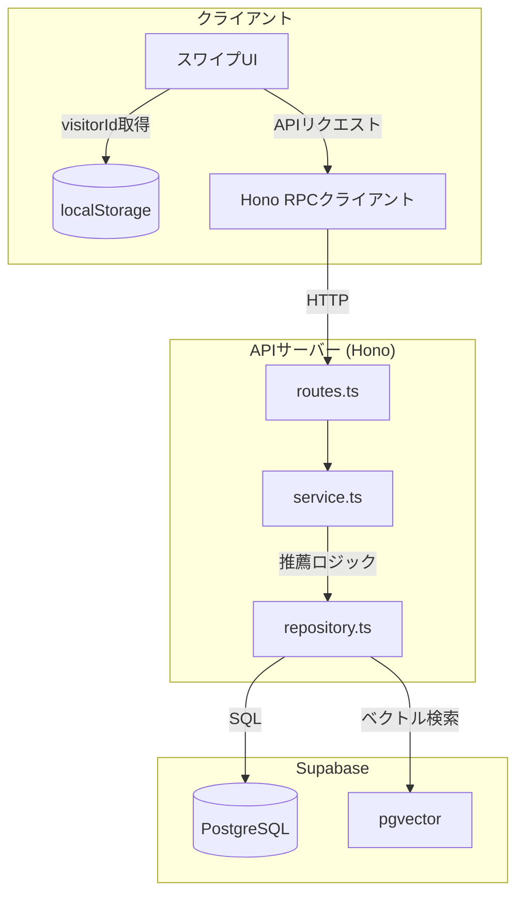

# recommend-scp アーキテクチャ

このドキュメントはrecommend-scpプロジェクトのアーキテクチャを定義する。
Claude Codeは実装時に必ずこのドキュメントを参照すること。

---

## システム概要

recommend-scpは、SCP Foundation記事の推薦システム。
ハイブリッド推薦（Embedding + タグ）により、ユーザーの嗜好に合った記事を提案する。

**特徴:**

- ユーザー登録不要（ゲスト利用）
- WebViewで元サイト記事を表示
- 将来のアカウント連携パスを確保

---

## 技術スタック

| コンポーネント    | 技術                             | 選定理由                                  |
| ----------------- | -------------------------------- | ----------------------------------------- |
| 言語              | TypeScript                       | フロントエンド/バックエンド統一の型安全性 |
| データベース      | Supabase (PostgreSQL + pgvector) | RLS + ベクトル検索                        |
| APIサーバー       | Hono (独立サーバー)              | 高性能、RPC型共有、フロントエンド分離     |
| Webフレームワーク | Next.js App Router               | Server Components、静的最適化             |
| モノレポ          | Turborepo                        | 高速ビルド、キャッシュ                    |
| ホスティング      | Vercel (Web + API)               | 統合デプロイ、Next.js API Routes経由      |

---

## ディレクトリ構成

```
recommend-scp/
├── apps/
│   ├── api-server/              # Hono独立サーバー (EPIC-005)
│   │   ├── src/
│   │   │   ├── index.ts         # エントリーポイント
│   │   │   ├── app.ts           # Honoアプリ定義
│   │   │   └── domains/         # ドメイン別Colocation
│   │   │       ├── articles/    # 記事検索
│   │   │       ├── recommend/   # 推薦取得
│   │   │       ├── feedback/    # Like/Dislike
│   │   │       ├── onboarding/  # スターターパック
│   │   │       └── visitors/    # visitorId管理
│   │   └── package.json
│   └── web/                     # Next.js App Router (将来)
│       ├── app/
│       ├── components/
│       └── lib/
│           └── api-client.ts    # Hono RPCクライアント
├── packages/
│   ├── shared/                  # 共有ロジック
│   │   └── src/
│   │       ├── recommendation/  # 推薦エンジン (EPIC-004)
│   │       ├── storage/         # ストレージ抽象化
│   │       └── onboarding/      # オンボーディング
│   ├── pipeline/                # データパイプライン (EPIC-003)
│   ├── api-types/               # Hono RPC型定義 (EPIC-005)
│   │   └── src/
│   │       └── index.ts         # AppType export
│   └── poc/                     # PoC (EPIC-001)
├── .ai/                         # AI用ドキュメント
├── .claude/                     # Claude専用設定
└── specs/                       # 仕様書
```

---

## アーキテクチャ原則

### 1. ドメイン別Colocation

各ドメインは以下のファイルを同一ディレクトリに配置:

```
domains/[domain]/
├── routes.ts      # APIエンドポイント定義
├── service.ts     # ビジネスロジック
├── repository.ts  # DB操作層
├── schema.ts      # Zodバリデーション
├── types.ts       # 型定義
└── __dev__/       # テストファイル
    ├── routes.test.ts
    ├── service.test.ts
    └── repository.test.ts
```

### 2. 依存フローの方向

```
routes → service → repository → Supabase
  ↓
schema (バリデーション)
```

**禁止:** 逆方向の依存（repository → service 等）

### 3. Repository層によるDB抽象化

- 全DB操作はRepository経由（直接Supabase禁止）
- snake_case ↔ camelCase 変換はRepository層で実施
- RLS (Row Level Security) を活用

### 4. Hono RPC型共有

```typescript
// packages/api-types/src/index.ts
import type { AppType } from "../../apps/api-server/src/app";
export type { AppType };

// apps/web/lib/api-client.ts
import { hc } from "hono/client";
import type { AppType } from "@recommend-scp/api-types";

export const api = hc<AppType>(process.env.NEXT_PUBLIC_API_URL!);
```

---

## 責務分離

### サーバー主導アーキテクチャ（EPIC-005〜）

| 処理                    | クライアント    | サーバー      |
| ----------------------- | --------------- | ------------- |
| visitorId生成           | ✅ UUID生成     | -             |
| visitorId保存           | ✅ localStorage | ✅ DB         |
| 嗜好プロファイル        | -               | ✅ 計算・保存 |
| 推薦スコア計算          | -               | ✅            |
| ベクトル検索            | -               | ✅            |
| フィードバック記録      | -               | ✅            |
| APIレスポンスキャッシュ | ✅              | -             |

### データフロー



---

## ストレージ戦略

### 変遷

| フェーズ           | ストレージ | 理由                                             |
| ------------------ | ---------- | ------------------------------------------------ |
| EPIC-004（当初）   | IndexedDB  | クライアント側完結、オフライン対応               |
| EPIC-005（変更後） | Supabase   | サーバー主導、複数端末対応、将来のアカウント連携 |

### 現在の構成

- **サーバー側**: SupabasePreferenceStorage（プライマリ）
- **クライアント側**: IndexedDBStorage（PWAオフラインモード用、将来対応）

### 移行理由

1. **複数端末対応**: サーバーに保存することで端末間でデータ共有
2. **アカウント連携**: 将来のSupabase Auth統合に備える
3. **分析基盤**: サーバー側でユーザー行動データを収集

---

## 認証設計

### Phase 1: 匿名利用 (MVP)

```typescript
// クライアント側
const getOrCreateVisitorId = (): string => {
  let visitorId = localStorage.getItem("visitor_id");
  if (!visitorId) {
    visitorId = crypto.randomUUID();
    localStorage.setItem("visitor_id", visitorId);
  }
  return visitorId;
};
```

### Phase 2: アカウント連携 (将来)

```sql
-- visitors テーブル
CREATE TABLE visitors (
  id UUID PRIMARY KEY DEFAULT gen_random_uuid(),
  visitor_id TEXT UNIQUE NOT NULL,      -- クライアント生成UUID
  user_id UUID REFERENCES auth.users,   -- Supabase Auth連携後に設定
  preference_vector vector(1536),       -- 嗜好ベクトル
  created_at TIMESTAMPTZ DEFAULT now(),
  updated_at TIMESTAMPTZ DEFAULT now()
);
```

**連携フロー:**

1. 匿名で利用開始（visitor_idのみ）
2. アカウント作成時にuser_idを紐付け
3. 複数端末の履歴をマージ

---

## APIエンドポイント設計

### MVP範囲

| メソッド | パス                 | 説明                 | レスポンス目標 |
| -------- | -------------------- | -------------------- | -------------- |
| POST     | `/visitors`          | visitorId登録        | 200ms          |
| GET      | `/articles/search`   | ベクトル検索         | 200ms          |
| POST     | `/recommend`         | 推薦取得             | 200ms          |
| POST     | `/feedback`          | Like/Dislike記録     | 200ms          |
| GET      | `/onboarding/packs`  | スターターパック一覧 | 200ms          |
| POST     | `/onboarding/select` | パック選択・初期化   | 200ms          |

### 将来対応

| メソッド | パス                | 説明                 |
| -------- | ------------------- | -------------------- |
| POST     | `/visitors/link`    | アカウント連携       |
| GET      | `/visitors/profile` | 嗜好プロファイル取得 |

### エラーレスポンス (RFC 7807)

```typescript
// Problem Details形式
interface ProblemDetails {
  type: string;        // エラータイプURI
  title: string;       // 人間可読なタイトル
  status: number;      // HTTPステータスコード
  detail?: string;     // 詳細説明
  instance?: string;   // 問題発生箇所
}

// 例
{
  "type": "https://recommend-scp.dev/errors/not-found",
  "title": "Resource Not Found",
  "status": 404,
  "detail": "Visitor with id 'xxx' not found",
  "instance": "/visitors/xxx"
}
```

---

## パフォーマンス要件

| 指標          | 目標値        | 備考           |
| ------------- | ------------- | -------------- |
| APIレスポンス | **200ms以下** | キャッシュ活用 |
| ベクトル検索  | 100ms以下     | pgvector HNSW  |
| 推薦計算      | 50ms以下      | 事前計算活用   |

### キャッシュ戦略

- **Redis/Upstash**: 推薦結果の短期キャッシュ（将来）
- **CDN**: 静的コンテンツ（スターターパック等）
- **クライアント**: APIレスポンスのメモリキャッシュ

---

## テスト戦略

| レベル     | 対象                       | 必須度       | ツール             |
| ---------- | -------------------------- | ------------ | ------------------ |
| 単体テスト | service, repository        | **必須**     | Vitest             |
| 統合テスト | routes (APIエンドポイント) | 必須         | Vitest + supertest |
| E2Eテスト  | AC準拠シナリオ             | AC要件に従う | Playwright         |

### テストファイル配置

```
domains/recommend/
├── service.ts
├── __dev__/
│   ├── service.test.ts      # 単体テスト
│   └── routes.test.ts       # 統合テスト
```

---

## ロギング

pinoを使用（既存pipeline実装と統一）:

```typescript
import { pino } from "pino";

const logger = pino({
  level: process.env.LOG_LEVEL || "info",
  transport: {
    target: "pino-pretty",
    options: { colorize: true },
  },
});

// 使用例
logger.info({ visitorId, articleId }, "推薦リクエスト受信");
logger.error({ err, visitorId }, "推薦計算エラー");
```

---

## デプロイ構成

```
┌──────────────────────────────┐
│         Vercel               │
│  ┌────────────────────────┐  │
│  │  Next.js (apps/web)    │  │
│  │  ├── App Router (SSR)  │  │
│  │  └── API Routes        │  │
│  │      /api/[...route]   │──┼──▶ Hono API (apps/api-server)
│  └────────────────────────┘  │     をNext.js API Routes経由で提供
└──────────────┬───────────────┘
               │
      ┌────────▼────────┐
      │   Supabase      │
      │   (PostgreSQL   │
      │    + pgvector)  │
      └─────────────────┘
```

**Note:** `apps/api-server` はローカル開発用のスタンドアロンサーバーとしても動作。
本番環境では `apps/web/src/app/api/[...route]/route.ts` 経由で提供。

### 環境変数

```bash
# Vercel (本番) - Web + API 統合
SUPABASE_URL=https://xxx.supabase.co
SUPABASE_SERVICE_ROLE_KEY=xxx  # サーバーサイドDB操作用
SUPABASE_ANON_KEY=xxx          # クライアントサイド用（将来）
OPENAI_API_KEY=xxx             # Embedding用

# ローカル開発 (apps/api-server スタンドアロン)
# .env で同じ変数を設定
```

---

## 参照ドキュメント

- [コーディングガイドライン](.ai/coding-guidelines.md)
- [EPIC-004: 推薦ロジック](specs/004-recommend/004-recommend.md)
- [EPIC-005: バックエンドAPI](specs/005-backend-api/005-backend-api.md)
