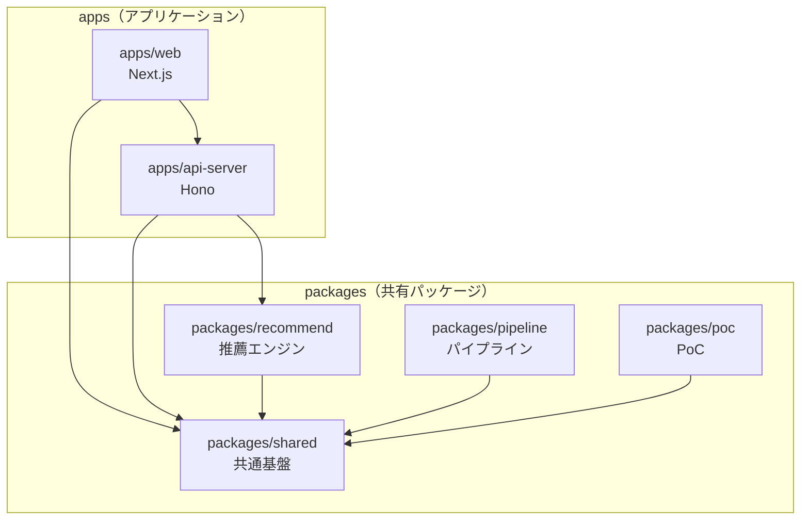

# パッケージ構造

このドキュメントでは、recommend-scpプロジェクトのパッケージ構造と各パッケージの責務を説明します。

## 概要

本プロジェクトはpnpm workspaceを使用したモノレポ構成です。

```
recommend-scp/
├── apps/                   # アプリケーション（将来）
│   ├── web/                # Next.js Webアプリ（EPIC-006）
│   └── api-server/         # Hono APIサーバー（EPIC-005）
├── packages/               # 共有パッケージ
│   ├── shared/             # 共通基盤 + 純粋ロジック
│   ├── poc/                # PoC（EPIC-001成果物）
│   ├── pipeline/           # データパイプライン（EPIC-003成果物）
│   └── recommend/          # 推薦エンジン（EPIC-004、将来）
└── supabase/               # DBマイグレーション
    └── migrations/
```

---

## 現在のパッケージ（実装済み/進行中）

### @recommend-scp/shared

**責務:** 純粋なビジネスロジックと共通基盤

複数のパッケージから参照される共通コードを集約。EPIC-004（推薦）、005（API）、006（フロントエンド）でも再利用されます。

```
packages/shared/
├── package.json        # @recommend-scp/shared
├── tsconfig.json
├── vitest.config.ts
└── src/
    ├── lib/            # 共通基盤
    │   ├── env.ts          # 環境変数の検証・管理
    │   └── supabase.ts     # Supabaseクライアント生成
    ├── types.ts        # 共通型定義
    ├── embedding/      # Embedding生成の純粋ロジック
    │   ├── index.ts        # re-export
    │   └── generate.ts     # OpenAI Embedding生成
    ├── tagging/        # タグ抽出の純粋ロジック
    │   ├── index.ts        # re-export
    │   ├── extract.ts      # LLMタグ抽出
    │   └── tag-dictionary-manager.ts  # タグ辞書管理
    └── search/         # 検索機能
        ├── index.ts        # re-export
        ├── vector-search.ts    # ベクトル検索
        └── hybrid-search.ts    # ハイブリッド検索
```

**使用例:**

```typescript
import { env } from "@recommend-scp/shared/lib/env";
import { createSupabaseAdmin } from "@recommend-scp/shared/lib/supabase";
import { generateEmbedding } from "@recommend-scp/shared/embedding";
import type { ScpArticleRaw } from "@recommend-scp/shared/types";
```

### @recommend-scp/poc

**責務:** PoC検証スクリプトとレポート生成

EPIC-001で作成されたPoC成果物。技術検証用スクリプトを維持。

```
packages/poc/
├── package.json        # @recommend-scp/poc
├── tsconfig.json
├── vitest.config.ts
├── data/               # 検証用データ（gitignore）
│   ├── raw/
│   └── processed/
├── scripts/            # 検証スクリプト
│   ├── 01-fetch.ts
│   ├── 02-embed.ts
│   ├── 03-tag.ts
│   ├── 04-search.ts
│   └── 05-report.ts
└── src/
    ├── index.ts        # エントリポイント
    └── report/         # 検証レポート生成
        └── generate-report.ts
```

### @recommend-scp/pipeline

**責務:** データパイプライン固有の処理

EPIC-003で作成されるデータパイプライン。DBステータス管理、バッチ処理、オーケストレーションを含む。

```
packages/pipeline/
├── package.json        # @recommend-scp/pipeline
├── tsconfig.json
├── vitest.config.ts
└── src/
    ├── crawler/        # クローラー（003-02で実装）
    │   ├── types.ts        # BranchCrawler interface
    │   ├── factory.ts      # CrawlerFactory
    │   ├── english-crawler.ts  # EN全記事クローラー
    │   └── diff-crawler.ts     # 差分更新
    ├── processing/     # バッチ処理（003-03で実装）
    │   ├── batch-embedding.ts  # バッチEmbedding処理
    │   └── batch-tagging.ts    # バッチタグ抽出処理
    ├── orchestrator/   # 実行管理（003-04で実装）
    │   ├── orchestrator.ts     # パイプラインオーケストレーター
    │   ├── retry-processor.ts  # リトライキュー処理
    │   └── notification-service.ts  # 通知サービス
    └── migrations/     # DBスキーマテスト
        └── __dev__/
            ├── 003-01-01-language-schema.test.ts
            ├── 003-01-02-tag-dictionary.test.ts
            └── 003-01-03-pipeline-tables.test.ts
```

---

## 将来のパッケージ（計画中）

### @recommend-scp/recommend（EPIC-004: 推薦ロジック）

**責務:** 推薦エンジンのコアロジック

ε-greedy推薦、ユーザー履歴追跡、A/Bテスト基盤を実装予定。

```
packages/recommend/
├── package.json        # @recommend-scp/recommend
├── tsconfig.json
└── src/
    ├── index.ts
    ├── engine/         # 推薦エンジン
    │   ├── epsilon-greedy.ts   # ε-greedy アルゴリズム
    │   ├── collaborative.ts    # 協調フィルタリング
    │   └── hybrid.ts           # ハイブリッド推薦
    ├── user/           # ユーザー関連
    │   ├── history.ts          # スワイプ履歴管理
    │   └── profile.ts          # ユーザープロファイル
    └── ab-test/        # A/Bテスト基盤
        └── experiment.ts
```

**主な機能:**

- ハイブリッド推薦（Embedding + タグ + 協調フィルタリング）
- 探索と活用のバランス（80%活用 / 20%探索）
- セレンディピティ枠（連続5記事類似 → 冒険枠）

---

### apps/api-server（EPIC-005: バックエンドAPI）

**責務:** RESTエンドポイントの提供

Honoを使用した高パフォーマンスAPIサーバー。

```
apps/api-server/
├── package.json        # @recommend-scp/api-server
├── tsconfig.json
└── src/
    ├── index.ts        # エントリポイント
    ├── routes/         # ルート定義
    │   ├── search.ts       # 検索API
    │   ├── recommend.ts    # 推薦API
    │   ├── feedback.ts     # フィードバック収集API
    │   └── user.ts         # ユーザーAPI
    ├── middleware/     # ミドルウェア
    │   ├── auth.ts         # 認証
    │   ├── rate-limit.ts   # レート制限
    │   └── cors.ts         # CORS
    └── services/       # サービス層
        └── ...
```

**主なエンドポイント:**
| メソッド | パス | 説明 |
|---------|------|------|
| GET | `/api/search` | ハイブリッド検索 |
| GET | `/api/recommend` | 推薦記事取得 |
| POST | `/api/feedback` | スワイプフィードバック |
| GET | `/api/user/profile` | ユーザープロファイル |

---

### apps/web（EPIC-006: フロントエンドUI）

**責務:** ユーザー向けWebアプリケーション

Next.js App Routerを使用したスワイプ形式UIアプリ。

```
apps/web/
├── package.json        # @recommend-scp/web
├── next.config.js
├── tsconfig.json
└── src/
    ├── app/            # App Router
    │   ├── layout.tsx
    │   ├── page.tsx        # ホーム（スワイプUI）
    │   ├── search/         # 検索画面
    │   ├── article/[id]/   # 記事詳細
    │   └── profile/        # プロファイル
    ├── components/     # UIコンポーネント
    │   ├── swipe/          # スワイプカード
    │   ├── article/        # 記事表示
    │   └── common/         # 共通UI
    ├── hooks/          # カスタムフック
    └── lib/            # ユーティリティ
```

**主な画面:**

- **ホーム**: スワイプ形式レコメンド（Tinder風UI）
- **検索**: キーワード・タグ検索
- **記事詳細**: SCP記事全文表示
- **プロファイル**: 履歴・お気に入り管理

---

## 依存関係



---

## 設計方針: shared vs pipeline の責務分離

| パッケージ   | 責務                   | 含むもの                                                                                       |
| ------------ | ---------------------- | ---------------------------------------------------------------------------------------------- |
| **shared**   | 純粋なビジネスロジック | Embedding生成関数、タグ抽出関数、タグ辞書マネージャー、検索関数                                |
| **pipeline** | パイプライン固有の処理 | バッチ処理（DBステータス管理、チェックポイント、リトライ連携）、クローラー、オーケストレーター |

### 分離の理由

1. **再利用性**: sharedはEPIC-004〜006で再利用される純粋ロジックのみを含む
2. **テスト容易性**: 純粋ロジックは単体テストが容易
3. **依存関係の明確化**: パイプライン固有のDB操作（ステータス管理、リトライキュー）はpipelineに閉じ込める
4. **将来の拡張性**: EPIC-004でリアルタイム処理が必要な場合も、sharedの純粋ロジックをそのまま使用可能

---

## 設計判断: recommend パッケージを api-server から分離した理由

推薦ロジック（`packages/recommend`）を`apps/api-server`に含めず、独立パッケージとした理由を記録する。

### 責務の違い

| パッケージ   | レイヤー   | 責務                                               |
| ------------ | ---------- | -------------------------------------------------- |
| `api-server` | インフラ層 | HTTPリクエスト処理、認証、レート制限、ルーティング |
| `recommend`  | ドメイン層 | 推薦アルゴリズム、ε-greedy、協調フィルタリング     |

推薦ロジックは**ドメインロジック（ビジネスの核）**であり、api-serverはその**配信手段（インフラ層）**。核となるロジックをインフラ層に埋め込むと、テスト・再利用・将来の拡張が困難になる。

### 分離のメリット

#### 1. 単一責任の原則（SRP）

api-serverに推薦ロジックを入れると「HTTPを扱う責務」と「推薦を計算する責務」が混在する。責務を分離することで、各パッケージの変更理由が単一になる。

#### 2. テスタビリティ

```typescript
// packages/recommend - 純粋関数としてテスト可能
const result = recommend(userHistory, candidateArticles, { epsilon: 0.2 });
expect(result).toHaveLength(10);

// HTTPの依存なしで高速にユニットテスト実行可能
```

api-server内にあると、テスト時にHTTPレイヤーのモックが必要になり、テストが複雑化・低速化する。

#### 3. 再利用性

`@recommend-scp/recommend`は以下から利用可能：

- `apps/api-server` - REST API経由で推薦提供
- `apps/web` - SSR時に直接呼び出し（API経由せずに高速化）
- `packages/pipeline` - バッチ処理で事前計算
- CLIツール - デバッグ・検証用

api-server内にあると、他からの利用時に不要なHTTP依存（Hono等）を引き込む。

#### 4. デプロイの柔軟性

将来的な選択肢：

- 推薦ロジックだけをLambda/Cloudflare Workersで実行
- 重い計算をバックグラウンドワーカーに分離
- マイクロサービス化

ロジックが分離されていれば、これらの選択肢が容易になる。

#### 5. 依存関係の方向

```
apps/api-server
    ↓ 依存
packages/recommend
    ↓ 依存
packages/shared
```

上位レイヤー（api-server）が下位レイヤー（recommend）に依存する正しい方向。逆にすると循環依存のリスクが生じる。

### 結論

ドメインロジックとインフラ層を分離することで、テスト容易性・再利用性・拡張性を確保する。この設計はクリーンアーキテクチャの原則に従っている。

---

## CLIコマンド

```bash
# パイプライン実行
pnpm --filter pipeline run --mode=full
pnpm --filter pipeline run --mode=diff
pnpm --filter pipeline run --mode=embedding
pnpm --filter pipeline run --mode=tagging

# PoC検証スクリプト
pnpm --filter poc run:01-fetch
pnpm --filter poc run:02-embed
pnpm --filter poc run:03-tag
pnpm --filter poc run:04-search
pnpm --filter poc run:05-report

# テスト実行
pnpm --filter shared test
pnpm --filter pipeline test
pnpm --filter poc test

# 型チェック
pnpm --filter shared type-check
pnpm --filter pipeline type-check
```

## 技術スタック

| 項目        | 選定               | 理由               |
| ----------- | ------------------ | ------------------ |
| 言語        | TypeScript         | 型安全性           |
| モノレポ    | pnpm workspace     | 高速、ディスク効率 |
| Webアプリ   | Next.js App Router | SSR/SSG対応        |
| APIサーバー | Hono               | 高パフォーマンス   |
| DB / Auth   | Supabase           | PostgreSQL + RLS   |
| ベクトルDB  | Supabase pgvector  | 統合管理           |
| テスト      | Vitest             | 高速               |

## 関連ドキュメント

- [プロダクト構想書](./product-concept.md)
- [EPIC一覧](../specs/epic-list.md)
- [EPIC-003: データパイプライン本番化](../specs/003-data-pipeline/003-data-pipeline.md)
- [Story-003-00: パッケージ構造整備](../specs/003-data-pipeline/003-00-package-structure/003-00-package-structure.md)
