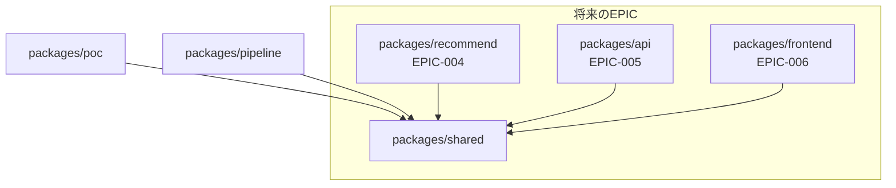

# パッケージ構造

このドキュメントでは、recommend-scpプロジェクトのパッケージ構造と各パッケージの責務を説明します。

## 概要

本プロジェクトはpnpm workspaceを使用したモノレポ構成です。以下の3つのパッケージで構成されます。

```
packages/
├── shared/     # 共通基盤 + 再利用可能な純粋ロジック
├── poc/        # PoC（EPIC-001成果物）
└── pipeline/   # データパイプライン（EPIC-003成果物）
```

## パッケージ詳細

### @recommend-scp/shared

**責務:** 純粋なビジネスロジックと共通基盤

複数のパッケージから参照される共通コードを集約。EPIC-004（推薦）、005（API）、006（フロントエンド）でも再利用されます。

```
packages/shared/
├── package.json        # @recommend-scp/shared
├── tsconfig.json
├── vitest.config.ts
└── src/
    ├── lib/            # 共通基盤
    │   ├── env.ts          # 環境変数の検証・管理
    │   └── supabase.ts     # Supabaseクライアント生成
    ├── types.ts        # 共通型定義
    ├── embedding/      # Embedding生成の純粋ロジック
    │   ├── index.ts        # re-export
    │   └── generate.ts     # OpenAI Embedding生成
    ├── tagging/        # タグ抽出の純粋ロジック
    │   ├── index.ts        # re-export
    │   ├── extract.ts      # LLMタグ抽出
    │   └── tag-dictionary-manager.ts  # タグ辞書管理
    └── search/         # 検索機能
        ├── index.ts        # re-export
        ├── vector-search.ts    # ベクトル検索
        └── hybrid-search.ts    # ハイブリッド検索
```

**使用例:**
```typescript
import { env } from "@recommend-scp/shared/lib/env";
import { createSupabaseAdmin } from "@recommend-scp/shared/lib/supabase";
import { generateEmbedding } from "@recommend-scp/shared/embedding";
import type { ScpArticleRaw } from "@recommend-scp/shared/types";
```

### @recommend-scp/poc

**責務:** PoC検証スクリプトとレポート生成

EPIC-001で作成されたPoC成果物。技術検証用スクリプトを維持。

```
packages/poc/
├── package.json        # @recommend-scp/poc
├── tsconfig.json
├── vitest.config.ts
├── data/               # 検証用データ（gitignore）
│   ├── raw/
│   └── processed/
├── scripts/            # 検証スクリプト
│   ├── 01-fetch.ts
│   ├── 02-embed.ts
│   ├── 03-tag.ts
│   ├── 04-search.ts
│   └── 05-report.ts
└── src/
    ├── index.ts        # エントリポイント
    └── report/         # 検証レポート生成
        └── generate-report.ts
```

### @recommend-scp/pipeline

**責務:** データパイプライン固有の処理

EPIC-003で作成されるデータパイプライン。DBステータス管理、バッチ処理、オーケストレーションを含む。

```
packages/pipeline/
├── package.json        # @recommend-scp/pipeline
├── tsconfig.json
├── vitest.config.ts
└── src/
    ├── crawler/        # クローラー（003-02で実装）
    │   ├── types.ts        # BranchCrawler interface
    │   ├── factory.ts      # CrawlerFactory
    │   ├── english-crawler.ts  # EN全記事クローラー
    │   └── diff-crawler.ts     # 差分更新
    ├── processing/     # バッチ処理（003-03で実装）
    │   ├── batch-embedding.ts  # バッチEmbedding処理
    │   └── batch-tagging.ts    # バッチタグ抽出処理
    ├── orchestrator/   # 実行管理（003-04で実装）
    │   ├── orchestrator.ts     # パイプラインオーケストレーター
    │   ├── retry-processor.ts  # リトライキュー処理
    │   └── notification-service.ts  # 通知サービス
    └── migrations/     # DBスキーマテスト
        └── __dev__/
            ├── 003-01-01-language-schema.test.ts
            ├── 003-01-02-tag-dictionary.test.ts
            └── 003-01-03-pipeline-tables.test.ts
```

## 依存関係



## 設計方針: shared vs pipeline の責務分離

| パッケージ | 責務 | 含むもの |
|-----------|------|---------|
| **shared** | 純粋なビジネスロジック | Embedding生成関数、タグ抽出関数、タグ辞書マネージャー、検索関数 |
| **pipeline** | パイプライン固有の処理 | バッチ処理（DBステータス管理、チェックポイント、リトライ連携）、クローラー、オーケストレーター |

### 分離の理由

1. **再利用性**: sharedはEPIC-004〜006で再利用される純粋ロジックのみを含む
2. **テスト容易性**: 純粋ロジックは単体テストが容易
3. **依存関係の明確化**: パイプライン固有のDB操作（ステータス管理、リトライキュー）はpipelineに閉じ込める
4. **将来の拡張性**: EPIC-004でリアルタイム処理が必要な場合も、sharedの純粋ロジックをそのまま使用可能

## CLIコマンド

```bash
# パイプライン実行
pnpm --filter pipeline run --mode=full
pnpm --filter pipeline run --mode=diff
pnpm --filter pipeline run --mode=embedding
pnpm --filter pipeline run --mode=tagging

# PoC検証スクリプト
pnpm --filter poc run:01-fetch
pnpm --filter poc run:02-embed
pnpm --filter poc run:03-tag
pnpm --filter poc run:04-search
pnpm --filter poc run:05-report

# テスト実行
pnpm --filter shared test
pnpm --filter pipeline test
pnpm --filter poc test

# 型チェック
pnpm --filter shared type-check
pnpm --filter pipeline type-check
```

## 関連ドキュメント

- [EPIC-003: データパイプライン本番化](../specs/003-data-pipeline/003-data-pipeline.md)
- [Story-003-00: パッケージ構造整備](../specs/003-data-pipeline/003-00-package-structure/003-00-package-structure.md)
