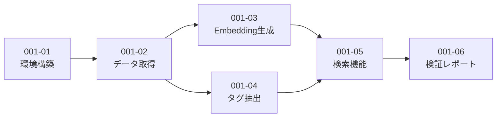

# Story一覧 - EPIC-001: 技術検証（PoC）

| ID | 名前 | ステータス | 依存 |
|----|------|----------|------|
| [001-01](./001-01-setup/001-01-setup.md) | 環境構築 | completed | - |
| [001-02](./001-02-crawl/001-02-crawl.md) | データ取得 | completed | 001-01 |
| [001-03](./001-03-embed/001-03-embed.md) | Embedding生成 | pending | 001-02 |
| [001-04](./001-04-tag/001-04-tag.md) | タグ抽出 | pending | 001-02 |
| [001-05](./001-05-search/001-05-search.md) | 検索機能 | pending | 001-03, 001-04 |
| [001-06](./001-06-report/001-06-report.md) | 検証レポート | pending | 001-05 |

## 依存関係図

