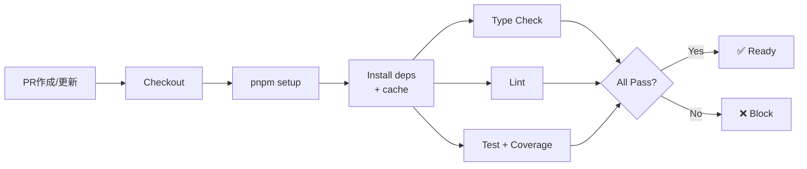

# Subtask 002-03-01: CIワークフロー設定

## 概要

GitHub ActionsでCIワークフローを設定し、PR時に自動でテスト・型チェック・Lintを実行する。テストカバレッジレポートも生成する。

## ユーザーストーリー

**As a** 開発者（AI/人間）
**I want** PRを作成した際に自動的に品質チェックが実行される
**So that** 品質の低いコードがmainブランチにマージされることを防げる

## Acceptance Criteria（EARS記法）

### AC-1: PRトリガーCI

- [ ] WHEN プルリクエストが作成または更新された際
      GIVEN mainブランチへのPRである場合
      THEN CIワークフローが自動実行される
      AND 型チェック、テスト、Lintが実行される

### AC-2: CI結果の可視化（成功）

- [ ] WHEN CIが完了した際
      GIVEN すべてのチェックが成功した場合
      THEN PRにグリーンチェックが表示される

### AC-3: CI結果の可視化（失敗）

- [ ] WHEN CIが完了した際
      GIVEN いずれかのチェックが失敗した場合
      THEN PRにレッドXが表示される
      AND 失敗したステップが明示される

### AC-4: キャッシュ最適化

- [ ] WHILE CIが実行されている間
      THE SYSTEM SHALL pnpmの依存関係をキャッシュする
      AND 2回目以降のビルド時間を短縮する

### AC-5: テストカバレッジ

- [ ] WHEN CIでテストが実行された際
      THEN カバレッジレポートが生成される
      AND PRコメントまたはサマリーでカバレッジ率が表示される

## 技術設計

### ワークフロー構成



### CI設定ファイル（.github/workflows/ci.yml）

```yaml
name: CI

on:
  pull_request:
    branches: [main]

jobs:
  check:
    runs-on: ubuntu-latest
    steps:
      - name: Checkout
        uses: actions/checkout@v4

      - name: Setup pnpm
        uses: pnpm/action-setup@v4

      - name: Setup Node.js
        uses: actions/setup-node@v4
        with:
          node-version: 22
          cache: "pnpm"

      - name: Install dependencies
        run: pnpm install --frozen-lockfile

      - name: Type Check
        run: pnpm type-check

      - name: Lint
        run: pnpm lint

      - name: Test with Coverage
        run: pnpm test:coverage

      - name: Coverage Report
        uses: davelosert/vitest-coverage-report-action@v2
        if: always()
```

### package.json更新

```json
{
  "scripts": {
    "test:coverage": "vitest run --coverage"
  }
}
```

### Vitest カバレッジ設定

```typescript
// vitest.config.ts に追加
export default defineConfig({
  test: {
    coverage: {
      provider: "v8",
      reporter: ["text", "json-summary", "json"],
      reportOnFailure: true,
    },
  },
});
```

### 必要なパッケージ

```bash
pnpm add -D @vitest/coverage-v8
```

## テストケース

- [ ] PRを作成するとCIが自動実行される
- [ ] 型エラーがあるとCIが失敗する
- [ ] LintエラーがあるとCIが失敗する
- [ ] テストが失敗するとCIが失敗する
- [ ] すべて成功するとグリーンチェックが表示される
- [ ] カバレッジレポートがPRに表示される

## ステータス

- **status**: pending
