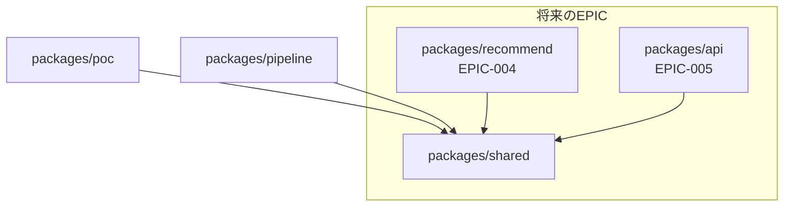

# Story-003-00: パッケージ構造整備

## 概要

PoCディレクトリ（`packages/poc/`）から本番用コードを分離し、責務に基づいたパッケージ構造を構築する。

## 背景

EPIC-001（PoC）完了後、EPIC-003（データパイプライン本番化）の実装を進めるにあたり、以下の問題が顕在化した：

1. **意味論的矛盾**: 「本番用クローラー」が「poc」ディレクトリに配置される設計
2. **責務の混在**: 共通基盤（lib, types）とPoC固有コード（scripts, report）が混在
3. **将来の負債**: EPIC-004以降で使用するコード（embedding, tagging, search）がpipelineに依存

## ユーザーストーリー

**ペルソナ**: 開発者（現在および将来のコントリビューター）

**目的**: PoCと本番コードを分離し、責務に基づいたパッケージ構造を構築する

**価値**:
- コードベースの意味論的整合性を確保
- 将来のEPIC（004, 005, 006）での再利用を容易化
- 新規参加者の理解を促進

**理由**:
- EPIC-003開始時点が最適な移行タイミング
- 後から統合は困難、後から分離は容易

## スコープ

### 含む

- `packages/shared/` パッケージの新規作成
- `packages/pipeline/` パッケージの新規作成
- 既存コードの適切なパッケージへの移行
- `packages/poc/` の参照更新
- 003系specファイルのパス修正

### 含まない

- 001系spec（PoC）のパス修正（履歴として維持）
- 機能の変更・追加
- テストの追加（移行後の動作確認のみ）

## 技術設計

### 移行後のパッケージ構造

```
packages/
├── shared/                 # 共通基盤 + 再利用可能な純粋ロジック
│   ├── package.json        # @recommend-scp/shared
│   ├── tsconfig.json
│   └── src/
│       ├── lib/            # env.ts, supabase.ts
│       ├── types.ts        # 共通型定義
│       ├── embedding/      # Embedding生成の純粋ロジック（003, 004で使用）
│       │   └── generate.ts
│       ├── tagging/        # タグ抽出の純粋ロジック（003, 004で使用）
│       │   ├── extract.ts
│       │   └── tag-dictionary-manager.ts
│       └── search/         # 検索機能（004, 005, 006で使用）
│
├── poc/                    # PoC（EPIC-001成果物）
│   ├── package.json        # @recommend-scp/poc
│   ├── scripts/            # 検証スクリプト（そのまま維持）
│   └── src/
│       ├── report/         # 検証レポート生成
│       └── index.ts        # エントリポイント
│
└── pipeline/               # データパイプライン（EPIC-003成果物）
    ├── package.json        # @recommend-scp/pipeline
    ├── tsconfig.json
    └── src/
        ├── crawler/        # クローラー（003-02で実装）
        ├── processing/     # バッチ処理（003-03で実装）
        │   ├── batch-embedding.ts    # DBステータス管理含むバッチ処理
        │   └── batch-tagging.ts      # DBステータス管理含むバッチ処理
        ├── orchestrator/   # 実行管理（003-04で実装）
        │   ├── orchestrator.ts
        │   ├── retry-processor.ts
        │   └── notification-service.ts
        └── migrations/     # DBスキーマテスト
```

### 設計方針: shared vs pipeline の責務分離

| パッケージ | 責務 | 含むもの |
|-----------|------|---------|
| **shared** | 純粋なビジネスロジック | Embedding生成関数、タグ抽出関数、タグ辞書マネージャー、検索関数 |
| **pipeline** | パイプライン固有の処理 | バッチ処理（DBステータス管理、チェックポイント、リトライ連携）、クローラー、オーケストレーター |

**理由:**
- sharedはEPIC-004（推薦）、005（API）、006（フロントエンド）で再利用される
- バッチ処理はパイプライン固有のDB操作（ステータス管理、リトライキュー）を含むため分離
- EPIC-004ではリアルタイム処理を行う可能性があり、バッチ処理の再利用は限定的

### 依存関係



### import文の変更

```typescript
// Before (poc内での相対パス)
import { env } from "../lib/env";
import type { ScpArticleRaw } from "../types";

// After (workspaceパッケージ参照)
import { env } from "@recommend-scp/shared/lib/env";
import type { ScpArticleRaw } from "@recommend-scp/shared/types";
```

## Acceptance Criteria

### パッケージ作成

- [ ] WHEN sharedパッケージを作成する際
      GIVEN pnpm workspaceを使用している場合
      THEN `packages/shared/` ディレクトリが作成される
      AND `package.json` の name が `@recommend-scp/shared` である
      AND `pnpm install` が正常に完了する

- [ ] WHEN pipelineパッケージを作成する際
      GIVEN sharedパッケージが存在する場合
      THEN `packages/pipeline/` ディレクトリが作成される
      AND `package.json` の name が `@recommend-scp/pipeline` である
      AND dependencies に `@recommend-scp/shared` が含まれる

### コード移行

- [ ] WHEN 共通コードをsharedに移行する際
      GIVEN `packages/poc/src/lib/`, `types.ts`, `search/` が存在する場合
      THEN これらが `packages/shared/src/` に移動される
      AND `embedding/generate.ts`, `tagging/extract.ts`, `tagging/tag-dictionary-manager.ts` の純粋ロジックが移動される
      AND 全テストが通過する

- [ ] WHEN パイプライン固有コードをpipelineに移行する際
      GIVEN `packages/poc/src/crawler/`, `migrations/` が存在する場合
      THEN これらが `packages/pipeline/src/` に移動される
      AND バッチ処理は `packages/pipeline/src/processing/` に配置される
      AND オーケストレーター関連は `packages/pipeline/src/orchestrator/` に配置される
      AND 全テストが通過する

### PoC参照更新

- [ ] WHEN pocパッケージの参照を更新する際
      GIVEN 相対パスでlib/, types.ts等を参照している場合
      THEN `@recommend-scp/shared` への参照に変更される
      AND pocの全テストが通過する

### Spec修正

- [ ] WHEN 003系specのパスを修正する際
      GIVEN `packages/poc` への参照が存在する場合
      THEN 適切なパッケージ（shared または pipeline）への参照に変更される
      AND 13ファイルすべてが更新される

## 関連Subtask

- [003-00-01: sharedパッケージ作成](./003-00-01-create-shared.md)
- [003-00-02: pipelineパッケージ作成](./003-00-02-create-pipeline.md)
- [003-00-03: PoC参照更新](./003-00-03-update-poc-refs.md)
- [003-00-04: Spec修正](./003-00-04-update-specs.md)

## リスクと対策

| リスク | 発生確率 | 影響度 | 対策 |
|--------|----------|--------|------|
| pnpm lockファイル不整合 | 低 | 中 | `pnpm install` で再生成 |
| import文の修正漏れ | 中 | 中 | grep で事前確認、テスト通過を必須化 |
| CIが失敗する | 低 | 中 | ローカルで全テスト通過確認後にpush |
