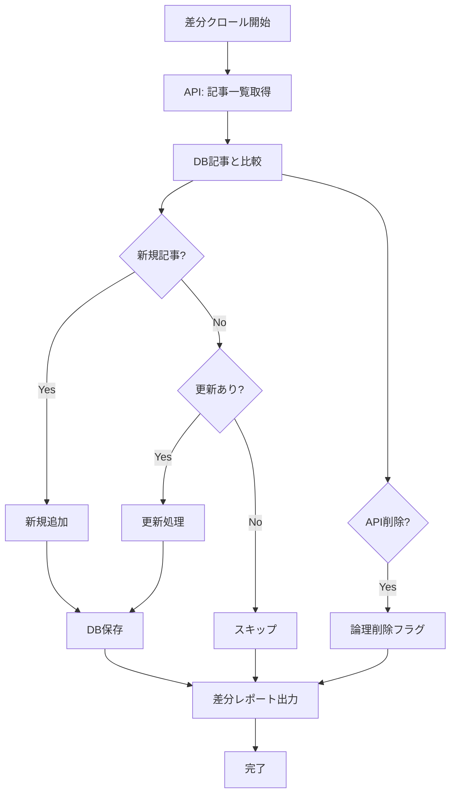

# Subtask-003-02-03: 差分更新機能

## 概要

フルクロールではなく、新規追加・更新・削除された記事のみを処理する差分更新機能を実装する。
定期実行時の処理時間とAPIコストを最小化する。

## ユーザーストーリー

**As a** 開発者/運用者
**I want** 差分更新でデータを最新化する
**So that** 定期実行時の処理時間とコストを最小化できる

## Acceptance Criteria（EARS記法）

### 新規記事検出

- [x] WHEN 差分クロールを実行した際
      GIVEN DBに存在しない記事がAPIにある場合
      THEN 新規記事として検出される
      AND DBに新規レコードが作成される
      AND `embedding_status: 'pending'` が設定される

### 更新記事検出

- [x] WHEN 差分クロールを実行した際
      GIVEN DBの記事とAPIの記事で更新日時が異なる場合
      THEN 更新記事として検出される
      AND DBのレコードが更新される
      AND `embedding_status: 'pending'` にリセットされる
      AND `tagging_status: 'pending'` にリセットされる

- [x] WHEN コンテンツハッシュを比較した際
      GIVEN 本文が変更されている場合
      THEN 更新が必要と判定される
      AND ハッシュが更新される

### 削除記事検出

- [x] WHEN 差分クロールを実行した際
      GIVEN DBに存在するがAPIに存在しない記事がある場合
      THEN 削除記事として検出される
      AND `is_deleted: true` フラグが設定される
      AND 物理削除は行わない（論理削除）

### 差分レポート

- [x] WHEN 差分クロールが完了した際
      GIVEN 処理が正常に完了した場合
      THEN 以下の統計を出力する：- 新規追加件数 - 更新件数 - 削除件数 - 変更なし件数 - 処理時間

### 最適化

- [x] WHILE 差分検出を行う際
      THE SYSTEM SHALL APIの更新日時フィールドを使用して効率的に検出する
      AND 本文取得は更新が必要な記事のみに限定する

## 設計

### 差分クロールフロー



### インターフェース

```typescript
// packages/pipeline/src/crawler/diff-crawler.ts

export interface DiffCrawlOptions {
  lang: string;
  onProgress?: (progress: DiffProgress) => void;
}

export interface DiffProgress {
  phase: "fetch_index" | "compare" | "fetch_content" | "save";
  current: number;
  total: number;
}

export interface DiffCrawlResult {
  newCount: number;
  updatedCount: number;
  deletedCount: number;
  unchangedCount: number;
  errors: CrawlError[];
  duration: number; // ミリ秒
}

export interface CrawlError {
  articleId: string;
  error: string;
  timestamp: Date;
}
```

### ハッシュ計算

```typescript
import { createHash } from "crypto";

export function computeContentHash(content: string): string {
  return createHash("sha256").update(content).digest("hex").slice(0, 16); // 先頭16文字
}
```

### 差分検出ロジック

```typescript
export async function detectChanges(
  apiArticles: ArticleIndex[],
  dbArticles: Map<string, DbArticle>
): Promise<{
  newArticles: ArticleIndex[];
  updatedArticles: ArticleIndex[];
  deletedIds: string[];
  unchangedIds: string[];
}> {
  const newArticles: ArticleIndex[] = [];
  const updatedArticles: ArticleIndex[] = [];
  const unchangedIds: string[] = [];

  // APIにある記事をチェック
  for (const article of apiArticles) {
    const dbArticle = dbArticles.get(article.id);
    if (!dbArticle) {
      newArticles.push(article);
    } else if (needsUpdate(article, dbArticle)) {
      updatedArticles.push(article);
    } else {
      unchangedIds.push(article.id);
    }
  }

  // DBにあるがAPIにない記事（削除）
  const apiIds = new Set(apiArticles.map((a) => a.id));
  const deletedIds = [...dbArticles.keys()].filter((id) => !apiIds.has(id));

  return { newArticles, updatedArticles, deletedIds, unchangedIds };
}
```

### 出力例

```
🔄 差分クロール開始 (EN)
  前回実行: 2025-01-04 03:00:00

📊 差分検出中...
  API記事数: 7050
  DB記事数: 7000

📥 変更記事取得中...
  新規: 50件
  更新: 10件

💾 DB更新中...
  ✅ 新規追加: 50件
  ✅ 更新: 10件
  ✅ 論理削除: 0件
  ⏭️ 変更なし: 6990件

✅ 差分クロール完了
  処理時間: 5分30秒
```

## テストケース

- [x] 新規記事が正しく検出される
- [x] 更新記事が正しく検出される（更新日時比較）
- [x] 更新記事が正しく検出される（ハッシュ比較）
- [x] 削除記事に論理削除フラグが設定される
- [x] 変更なし記事はスキップされる
- [x] 差分レポートが正しく出力される
- [x] 更新時に `embedding_status` がリセットされる
- [x] 更新時に `tagging_status` がリセットされる

## 実装状況

- **status**: completed
- **実装ファイル**:
  - `packages/pipeline/src/crawler/types.ts` - 差分クロール用型定義（DiffCrawlOptions, DiffProgress, DiffCrawlResult等）
  - `packages/pipeline/src/crawler/utils/content-hash.ts` - SHA-256コンテンツハッシュ計算
  - `packages/pipeline/src/crawler/diff-crawler.ts` - 差分クローラー（detectChanges, DiffCrawlerクラス）
  - `packages/pipeline/src/crawler/utils/diff-db-operations.ts` - 差分クロール用DB操作
- **テストファイル**:
  - `packages/pipeline/src/crawler/__dev__/diff-crawler.test.ts`
  - `packages/pipeline/src/crawler/utils/__dev__/content-hash.test.ts`
  - `packages/pipeline/src/crawler/utils/__dev__/diff-db-operations.test.ts`
