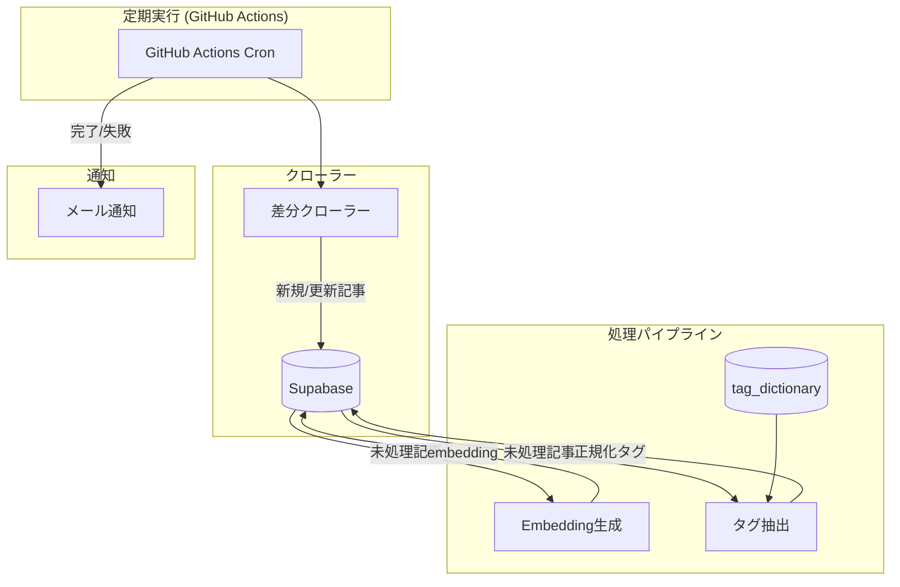

# EPIC-003: データパイプライン本番化

## 概要

PoCで検証済みのSCP推薦システムのデータパイプラインを、本番運用可能な状態に拡張する。
EN全記事（7000+件）の取得、差分更新、タグ辞書管理、定期実行を実現する。

## ユーザーストーリー

**ペルソナ**: 開発者 / システム管理者

**目的**: SCP記事データパイプラインを本番運用可能な状態にする

**価値**:

- 全記事（EN）を対象とした推薦システムの基盤を構築
- 運用負荷を最小化しながら継続的なデータ更新を実現

**理由**:

- PoCでは10-50件のみ対象だったが、本番では7000+件のEN記事が必要
- データの鮮度を保つために差分更新が必要
- タグの表記揺れを防ぐためにタグ辞書管理が必要
- 定期実行とエラーリカバリで安定運用を実現したい

## スコープ

### 含む

- EN全記事クロール（series-1〜8+）
- 差分更新機能（新規/更新/削除検出）
- タグ辞書DB管理（正規化、同義語対応）
- GitHub Actions定期実行（週次）
- メール通知・リトライ機能
- 多言語拡張性の担保（DB設計・クローラー抽象化）

### 含まない

- JP/KO/CN/FR支部のクローラー実装（拡張性のみ担保）
- 言語別Embeddingモデル切り替え
- Slack通知
- UI実装

## 技術設計

### データフロー

### コスト見積もり

| 項目 | 初回 | 月次運用 |
|------|------|----------|
| Embedding | ~$1.12 | ~$0.02 |
| タグ抽出 | ~$9.45 | ~$0.14 |
| **合計** | **~$10.57** | **~$0.16** |

## 関連Story

- [Story-003-01: DB基盤拡張](./003-01-db-foundation/003-01-db-foundation.md)
- [Story-003-02: クローラー本番化](./003-02-crawler/003-02-crawler.md)
- [Story-003-03: Embedding/タグ処理本番化](./003-03-processing/003-03-processing.md)
- [Story-003-04: パイプラインオーケストレーション](./003-04-orchestration/003-04-orchestration.md)

## 成果物

- DBマイグレーションスクリプト
- 本番用クローラー（`packages/poc/src/crawler/`）
- パイプラインオーケストレーター（`packages/poc/src/pipeline/`）
- GitHub Actions ワークフロー（`.github/workflows/data-pipeline.yml`）
