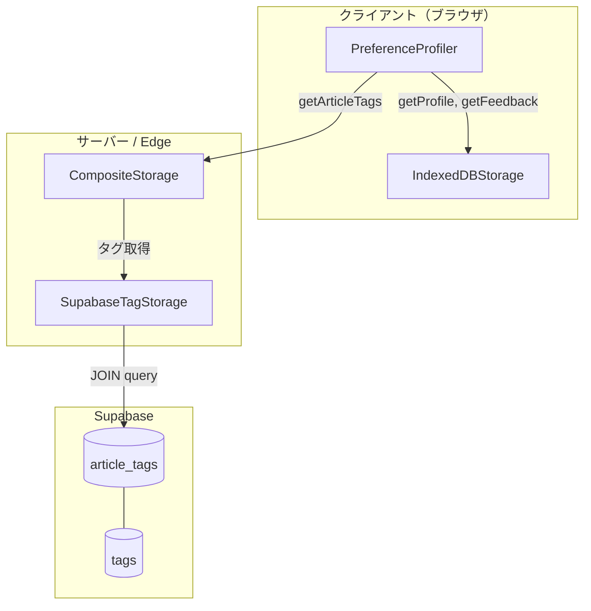

# 004-01-04: 記事タグ取得実装

## 基本情報

| 項目       | 内容                                   |
| ---------- | -------------------------------------- |
| ステータス | pending                                |
| 依存       | 004-01-01                              |
| 担当       | -                                      |
| 見積もり   | -                                      |

## ユーザーストーリー

**ペルソナ**: 推薦エンジン（システム）
**目的**: 記事のタグ情報を取得し、嗜好プロファイルの重み計算に使用する
**価値**: タグ重み計算が可能になり、ユーザー嗜好に基づく推薦精度が向上
**理由**: 現在はタグデータが取得できないため、Like/読了した記事のタグ重みが計算されない

## 背景

- 004-01-03「嗜好プロファイル計算」で `PreferenceProfiler` を実装済み
- `PreferenceStorage.getArticleTags(articleId)` インターフェースは定義済みだが、`IndexedDBStorage` では `null` を返す仮実装
- タグデータがないと嗜好プロファイルの重み計算ができず、推薦精度が低い

## Acceptance Criteria（EARS記法）

### 基本機能

- [ ] WHEN 記事IDを指定してタグを取得する際
      GIVEN 該当記事が `article_tags` テーブルに存在する場合
      THEN システムは関連するタグ値の配列を返す
      AND タグはカテゴリに関係なく全て含まれる（object_class, genre, theme, format）

- [ ] WHEN 記事IDを指定してタグを取得する際
      GIVEN 該当記事が存在しない、または `article_tags` にデータがない場合
      THEN システムは空配列 `[]` を返す

### エラーハンドリング

- [ ] WHEN Supabase接続に失敗した際
      GIVEN ネットワークエラーまたはDB接続エラーが発生した場合
      THEN システムはエラーをスローする
      AND エラーメッセージに原因を含める

### 既存実装との統合

- [ ] WHERE `PreferenceProfiler` が `getArticleTags` を呼び出す際
      IF Supabase対応のストレージが注入されている場合
      THE SYSTEM SHALL Supabaseからタグデータを取得して重み計算を行う

- [ ] WHERE `IndexedDBStorage` の既存実装
      THE SYSTEM SHALL 変更せず、引き続き `null` を返す
      AND クライアントサイド専用の設計を維持する

### 設計制約

- [ ] WHILE ストレージアダプタを実装する際
      THE SYSTEM SHALL 既存の `PreferenceStorage` インターフェースに準拠する
      AND 新規クラス `SupabaseTagStorage` と `CompositeStorage` として実装する

## 設計

### データフロー



### データベース構造

```sql
-- tags テーブル（マスタ）
CREATE TABLE tags (
  id SERIAL PRIMARY KEY,
  category TEXT NOT NULL,  -- 'object_class', 'genre', 'theme', 'format'
  value TEXT NOT NULL,
  UNIQUE(category, value)
);

-- article_tags テーブル（関連）
CREATE TABLE article_tags (
  article_id TEXT REFERENCES scp_articles(id) ON DELETE CASCADE,
  tag_id INTEGER REFERENCES tags(id) ON DELETE CASCADE,
  PRIMARY KEY(article_id, tag_id)
);
```

### タグ取得クエリ

```sql
SELECT t.value
FROM article_tags at
JOIN tags t ON at.tag_id = t.id
WHERE at.article_id = $1;
```

### ファイル構成

```
packages/shared/src/storage/
├── types.ts                    # 既存（変更なし）
├── indexed-db.ts               # 既存（変更なし）
├── supabase-tag-storage.ts     # 新規: タグ取得専用
└── composite-storage.ts        # 新規: 複合ストレージ
```

### インターフェース定義

```typescript
// packages/shared/src/storage/supabase-tag-storage.ts

import type { SupabaseClient } from "@supabase/supabase-js";

/**
 * タグ取得専用のストレージアダプタ
 *
 * Supabaseからタグデータを取得する。
 */
export class SupabaseTagStorage {
  constructor(private supabase: SupabaseClient) {}

  /**
   * 記事のタグ情報を取得
   * @param articleId 記事ID
   * @returns タグ値の配列。記事が存在しない場合は空配列
   * @throws Supabase接続エラー時
   */
  async getArticleTags(articleId: string): Promise<string[]> {
    const { data, error } = await this.supabase
      .from("article_tags")
      .select("tags(value)")
      .eq("article_id", articleId);

    if (error) {
      throw new Error(`Failed to fetch tags for article ${articleId}: ${error.message}`);
    }

    if (!data || data.length === 0) {
      return [];
    }

    return data.map((row) => row.tags.value);
  }
}
```

```typescript
// packages/shared/src/storage/composite-storage.ts

import type { PreferenceStorage, PreferenceProfile, ViewHistory, Feedback, RecommendationLog } from "./types";
import type { SupabaseTagStorage } from "./supabase-tag-storage";

/**
 * 複合ストレージアダプタ
 *
 * IndexedDB（ローカルデータ）とSupabase（タグデータ）を組み合わせる。
 */
export class CompositeStorage implements PreferenceStorage {
  constructor(
    private localStorage: PreferenceStorage,
    private tagStorage: SupabaseTagStorage
  ) {}

  // ローカルストレージに委譲
  getProfile(visitorId: string): Promise<PreferenceProfile | null> {
    return this.localStorage.getProfile(visitorId);
  }

  saveProfile(profile: PreferenceProfile): Promise<void> {
    return this.localStorage.saveProfile(profile);
  }

  getViewHistory(visitorId: string, limit?: number): Promise<ViewHistory[]> {
    return this.localStorage.getViewHistory(visitorId, limit);
  }

  addViewHistory(history: ViewHistory): Promise<void> {
    return this.localStorage.addViewHistory(history);
  }

  getFeedback(visitorId: string): Promise<Feedback[]> {
    return this.localStorage.getFeedback(visitorId);
  }

  getFeedbackByArticle(visitorId: string, articleId: string): Promise<Feedback | null> {
    return this.localStorage.getFeedbackByArticle(visitorId, articleId);
  }

  addFeedback(feedback: Feedback): Promise<void> {
    return this.localStorage.addFeedback(feedback);
  }

  getRecommendationLog(visitorId: string, limit?: number): Promise<RecommendationLog[]> {
    return this.localStorage.getRecommendationLog(visitorId, limit);
  }

  addRecommendationLog(log: RecommendationLog): Promise<void> {
    return this.localStorage.addRecommendationLog(log);
  }

  getDislikedArticleIds(visitorId: string): Promise<string[]> {
    return this.localStorage.getDislikedArticleIds(visitorId);
  }

  // タグはSupabaseから取得
  getArticleTags(articleId: string): Promise<string[] | null> {
    return this.tagStorage.getArticleTags(articleId);
  }
}
```

## テストケース

### 単体テスト: SupabaseTagStorage

- [ ] タグが存在する記事IDでタグ配列を取得できる
- [ ] 複数タグが存在する場合、全てのタグが配列に含まれる
- [ ] タグが存在しない記事IDで空配列を返す
- [ ] Supabaseエラー時に例外をスローする
- [ ] エラーメッセージに記事IDと原因が含まれる

### 単体テスト: CompositeStorage

- [ ] getProfile が localStorage に委譲される
- [ ] saveProfile が localStorage に委譲される
- [ ] getViewHistory が localStorage に委譲される
- [ ] addViewHistory が localStorage に委譲される
- [ ] getFeedback が localStorage に委譲される
- [ ] getFeedbackByArticle が localStorage に委譲される
- [ ] addFeedback が localStorage に委譲される
- [ ] getRecommendationLog が localStorage に委譲される
- [ ] addRecommendationLog が localStorage に委譲される
- [ ] getDislikedArticleIds が localStorage に委譲される
- [ ] getArticleTags が tagStorage に委譲される

### 統合テスト

- [ ] 実DBからタグを取得できる（CI用）
- [ ] PreferenceProfiler + CompositeStorage でタグ重み計算が動作する

## 実装メモ

- Supabaseクライアントは `getSupabaseClient()` を使用（anon key）
- テストではモックを注入してDB依存を排除
- `IndexedDBStorage` は変更しない（クライアントサイド専用設計を維持）
