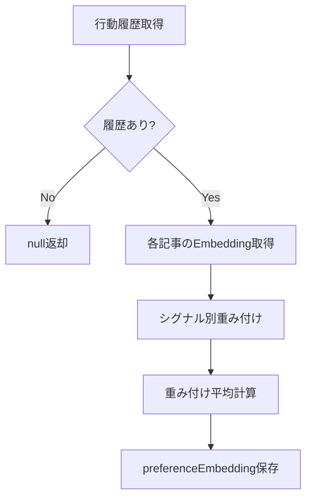

# Subtask 004-01-05: 嗜好ベクトル計算

## 概要

ユーザーの行動履歴（Like/お気に入り/読了/Dislike）から嗜好ベクトル（preferenceEmbedding）を計算する機能を実装する。シグナル別の重み付けとDislikeの負の重みを適用する。

## ステータス

- **status**: pending

## ユーザーストーリー

**As a** 推薦エンジン
**I want** ユーザーの行動履歴から嗜好ベクトルを計算できる
**So that** Embeddingベースの高精度な推薦を提供できる

## Acceptance Criteria（EARS記法）

- [ ] WHEN 嗜好ベクトルを計算する際
      GIVEN ユーザーにLike/お気に入り/読了履歴がある場合
      THEN 各記事のEmbeddingを重み付け平均して嗜好ベクトルを生成する
      AND 結果は1536次元のベクトルとなる

- [ ] WHEN 重み付け平均を計算する際
      THEN 以下のシグナル別重みを適用する: - お気に入り: 2.0（最も強い正シグナル）- Like: 1.0（強い正シグナル）- 読了（Like/Dislikeなし）: 0.3（弱い正シグナル）

- [ ] WHEN ユーザーにDislike履歴がある場合
      THEN Dislike記事のEmbeddingを負の重み（-0.5）で減算する
      AND 「避けるべき方向」として嗜好ベクトルに反映される

- [ ] WHEN 嗜好ベクトルを計算する際
      GIVEN 履歴が空の場合
      THEN nullを返す（オンボーディング未完了扱い）

- [ ] WHERE 嗜好ベクトル計算
      THE SYSTEM SHALL 計算結果をPreferenceProfile.preferenceEmbeddingに保存する

## 技術設計

### インターフェース

```typescript
// packages/shared/src/recommendation/preference-vector.ts

export interface SignalWeights {
  favorite: number; // デフォルト: 2.0
  like: number; // デフォルト: 1.0
  view: number; // デフォルト: 0.3
  dislike: number; // デフォルト: -0.5
}

export interface PreferenceVectorInput {
  favoriteArticleIds: string[];
  likedArticleIds: string[];
  viewedArticleIds: string[]; // Like/Dislikeなしの読了記事
  dislikedArticleIds: string[];
}

export async function calculatePreferenceVector(
  input: PreferenceVectorInput,
  getEmbedding: (articleId: string) => Promise<number[] | null>,
  weights?: Partial<SignalWeights>
): Promise<number[] | null>;
```

### アルゴリズム

```typescript
async function calculatePreferenceVector(
  input: PreferenceVectorInput,
  getEmbedding: (articleId: string) => Promise<number[] | null>,
  weights: SignalWeights = DEFAULT_WEIGHTS
): Promise<number[] | null> {
  const weightedVectors: { vector: number[]; weight: number }[] = [];

  // お気に入り記事（重み: 2.0）
  for (const id of input.favoriteArticleIds) {
    const embedding = await getEmbedding(id);
    if (embedding) {
      weightedVectors.push({ vector: embedding, weight: weights.favorite });
    }
  }

  // Like記事（重み: 1.0）
  for (const id of input.likedArticleIds) {
    const embedding = await getEmbedding(id);
    if (embedding) {
      weightedVectors.push({ vector: embedding, weight: weights.like });
    }
  }

  // 読了記事（重み: 0.3）
  for (const id of input.viewedArticleIds) {
    const embedding = await getEmbedding(id);
    if (embedding) {
      weightedVectors.push({ vector: embedding, weight: weights.view });
    }
  }

  // Dislike記事（負の重み: -0.5）
  for (const id of input.dislikedArticleIds) {
    const embedding = await getEmbedding(id);
    if (embedding) {
      weightedVectors.push({ vector: embedding, weight: weights.dislike });
    }
  }

  if (weightedVectors.length === 0) {
    return null;
  }

  // 重み付け平均を計算
  return computeWeightedAverage(weightedVectors);
}

function computeWeightedAverage(items: { vector: number[]; weight: number }[]): number[] {
  const dimension = items[0].vector.length;
  const result = new Array(dimension).fill(0);
  let totalWeight = 0;

  for (const { vector, weight } of items) {
    for (let i = 0; i < dimension; i++) {
      result[i] += vector[i] * weight;
    }
    totalWeight += Math.abs(weight);
  }

  // 正規化
  for (let i = 0; i < dimension; i++) {
    result[i] /= totalWeight;
  }

  return result;
}
```

### データフロー



## テストケース

- [ ] お気に入り記事のみの場合、そのEmbeddingがそのまま嗜好ベクトルになる
- [ ] Like + 読了の混合で正しく重み付け平均が計算される
- [ ] Dislike記事が負の重みで減算される
- [ ] 履歴が空の場合、nullが返る
- [ ] 記事のEmbeddingが取得できない場合、その記事はスキップされる
- [ ] 全記事のEmbeddingが取得できない場合、nullが返る

## 成果物

- `packages/shared/src/recommendation/preference-vector.ts`
- `packages/shared/src/recommendation/__tests__/preference-vector.test.ts`

## 依存関係

- 004-01-03: 嗜好プロファイル計算（拡張）
- 004-01-04: 記事タグ取得実装（Embedding取得に流用可能）
