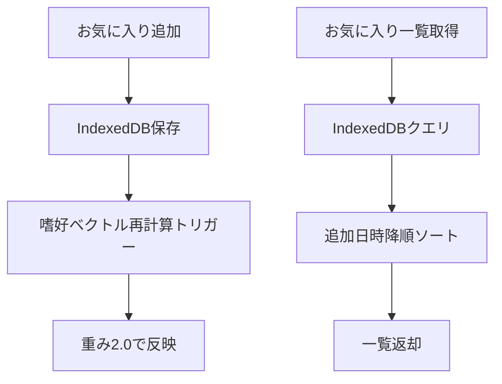

# Subtask 004-01-06: お気に入り機能

## 概要

ユーザーが記事を「お気に入り」として保存できる機能を実装する。お気に入りはLikeより強い正シグナルとして嗜好計算に反映される。

## ステータス

- **status**: pending

## ユーザーストーリー

**As a** SCPファン
**I want** 気に入った記事をお気に入りとして保存したい
**So that** 後で読み返せる＆より強く嗜好に反映される

## Acceptance Criteria（EARS記法）

- [ ] WHEN ユーザーが記事をお気に入りに追加した際
      THEN Favoriteレコードがストレージに保存される
      AND 嗜好ベクトル計算時にLikeより強い重み（2.0）で反映される

- [ ] WHEN ユーザーがお気に入り一覧を取得する際
      THEN 保存した全てのお気に入り記事が返される
      AND 追加日時の降順でソートされる

- [ ] WHEN ユーザーがお気に入りを解除した際
      THEN Favoriteレコードがストレージから削除される
      AND 次回の嗜好ベクトル計算から除外される

- [ ] WHEN 同じ記事を再度お気に入りに追加した際
      THEN 重複エラーにならず、追加日時が更新される

- [ ] WHERE お気に入り機能
      THE SYSTEM SHALL PreferenceStorageインターフェースに以下を追加する:
      - getFavorites(visitorId): お気に入り一覧取得
      - addFavorite(favorite): お気に入り追加
      - removeFavorite(visitorId, articleId): お気に入り解除

## 技術設計

### 型定義

```typescript
// packages/shared/src/storage/types.ts に追加

/**
 * お気に入り
 *
 * ユーザーが保存したお気に入り記事。Likeより強い正シグナル。
 */
export interface Favorite {
  /** 複合ID: `${visitorId}_${articleId}` */
  id: string;

  /** 訪問者ID */
  visitorId: string;

  /** 記事ID */
  articleId: string;

  /** 追加日時（ISO 8601形式） */
  addedAt: string;
}
```

### PreferenceStorage拡張

```typescript
// packages/shared/src/storage/types.ts のPreferenceStorageに追加

export interface PreferenceStorage {
  // 既存メソッド...

  /**
   * お気に入り一覧を取得
   * @param visitorId 訪問者ID
   * @returns お気に入りの配列（追加日時降順）
   */
  getFavorites(visitorId: string): Promise<Favorite[]>;

  /**
   * お気に入りを追加
   * @param favorite 追加するお気に入り
   */
  addFavorite(favorite: Favorite): Promise<void>;

  /**
   * お気に入りを解除
   * @param visitorId 訪問者ID
   * @param articleId 記事ID
   */
  removeFavorite(visitorId: string, articleId: string): Promise<void>;
}
```

### IndexedDB実装

```typescript
// packages/shared/src/storage/indexed-db.ts に追加

// IndexedDBのオブジェクトストア追加
const STORES = {
  // 既存...
  FAVORITES: "favorites",
};

// IndexedDBStorage クラスに追加
async getFavorites(visitorId: string): Promise<Favorite[]> {
  const db = await this.getDB();
  const tx = db.transaction(STORES.FAVORITES, "readonly");
  const store = tx.objectStore(STORES.FAVORITES);
  const index = store.index("visitorId");

  const favorites = await index.getAll(visitorId);

  // 追加日時降順でソート
  return favorites.sort((a, b) =>
    new Date(b.addedAt).getTime() - new Date(a.addedAt).getTime()
  );
}

async addFavorite(favorite: Favorite): Promise<void> {
  const db = await this.getDB();
  const tx = db.transaction(STORES.FAVORITES, "readwrite");
  const store = tx.objectStore(STORES.FAVORITES);

  // upsert（存在する場合は更新）
  await store.put(favorite);
  await tx.done;
}

async removeFavorite(visitorId: string, articleId: string): Promise<void> {
  const db = await this.getDB();
  const tx = db.transaction(STORES.FAVORITES, "readwrite");
  const store = tx.objectStore(STORES.FAVORITES);

  const id = `${visitorId}_${articleId}`;
  await store.delete(id);
  await tx.done;
}
```

### データフロー



## テストケース

- [ ] お気に入りを追加すると保存される
- [ ] お気に入り一覧が追加日時降順で返される
- [ ] お気に入りを解除すると削除される
- [ ] 同じ記事を再度追加すると追加日時が更新される
- [ ] 存在しないお気に入りを解除してもエラーにならない

## 成果物

- `packages/shared/src/storage/types.ts`（Favorite型追加）
- `packages/shared/src/storage/indexed-db.ts`（お気に入りメソッド追加）
- `packages/shared/src/storage/__tests__/indexed-db-favorite.test.ts`

## 依存関係

- 004-01-01: ストレージ抽象化レイヤー
- 004-01-02: IndexedDB実装
