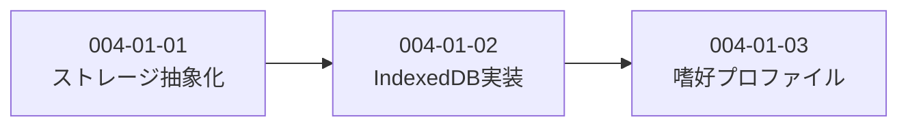

# Subtask 一覧 - Story 004-01: 推薦基盤

| ID                          | 名前                     | 概要                              | ステータス | 依存      |
| --------------------------- | ------------------------ | --------------------------------- | ---------- | --------- |
| [004-01-01](./004-01-01.md) | ストレージ抽象化レイヤー | PreferenceStorageインターフェース | completed  | -         |
| [004-01-02](./004-01-02.md) | IndexedDB実装            | IndexedDBStorageクラス            | pending    | 004-01-01 |
| [004-01-03](./004-01-03.md) | 嗜好プロファイル計算     | PreferenceProfilerクラス          | pending    | 004-01-02 |

## 依存関係図

