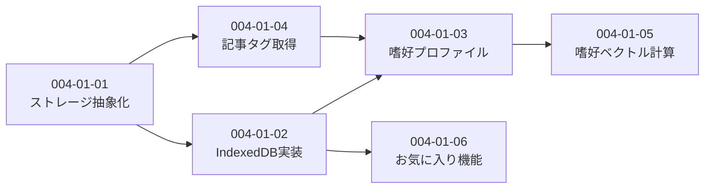

# Subtask 一覧 - Story 004-01: 推薦基盤

| ID                          | 名前                     | 概要                              | ステータス | 依存      |
| --------------------------- | ------------------------ | --------------------------------- | ---------- | --------- |
| [004-01-01](./004-01-01.md) | ストレージ抽象化レイヤー | PreferenceStorageインターフェース | completed  | -         |
| [004-01-02](./004-01-02.md) | IndexedDB実装            | IndexedDBStorageクラス            | completed  | 004-01-01 |
| [004-01-03](./004-01-03.md) | 嗜好プロファイル計算     | PreferenceProfilerクラス          | completed  | 004-01-02 |
| [004-01-04](./004-01-04.md) | 記事タグ取得実装         | SupabaseTagStorage + Composite    | completed  | 004-01-01 |
| [004-01-05](./004-01-05.md) | 嗜好ベクトル計算         | preferenceEmbedding計算           | pending    | 004-01-03 |
| [004-01-06](./004-01-06.md) | お気に入り機能           | Favorite保存・取得                | completed  | 004-01-02 |

## 依存関係図

## 実装順序

### 完了済み

1. ~~004-01-01: ストレージ抽象化レイヤー~~ ✅
2. ~~004-01-02: IndexedDB実装~~ ✅
3. ~~004-01-03: 嗜好プロファイル計算~~ ✅
4. ~~004-01-04: 記事タグ取得実装~~ ✅

### 残タスク

5. **004-01-06: お気に入り機能** ← 次はここから
6. **004-01-05: 嗜好ベクトル計算**

> **Note**: 004-01-06 は 004-01-05 より先に実装可能（並行依存なし）。
> お気に入り機能を先に実装することで、嗜好ベクトル計算時に利用できる。
