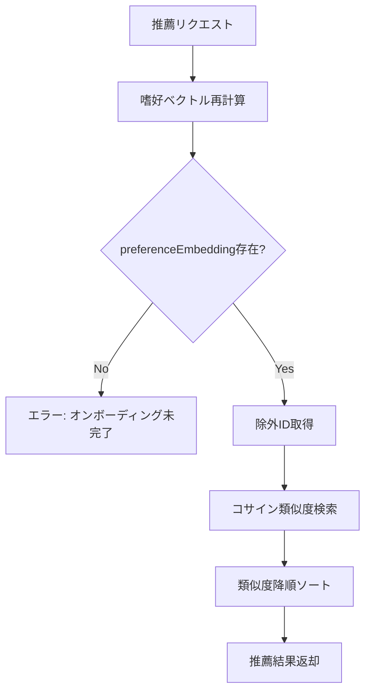

# Subtask 004-02-01: 推薦エンジンコア

## 概要

推薦ロジックのコアとなる`RecommendationEngine`クラスを実装する。**Embeddingベースの嗜好ベクトル**を使用してコサイン類似度で推薦候補を取得し、既読・Dislike済み記事を除外する。

## ステータス

- **status**: pending

## ユーザーストーリー

**As a** 推薦システム
**I want** ユーザーの嗜好ベクトルに基づいて記事を推薦できる
**So that** パーソナライズされた高精度な推薦を提供できる

## Acceptance Criteria（EARS記法）

- [ ] WHEN 推薦をリクエストした際
      GIVEN ユーザーの嗜好ベクトル（preferenceEmbedding）が存在する場合
      THEN 嗜好ベクトルとのコサイン類似度が高い記事を取得する
      AND 類似度降順でソートして返却する

- [ ] WHEN 推薦候補を返す際
      THEN 既読記事（viewHistory）を除外する
      AND Dislike済み記事を除外する
      AND お気に入り済み記事を除外する

- [ ] WHEN 推薦をリクエストした際
      GIVEN 嗜好ベクトルが存在しない場合
      THEN オンボーディング未完了エラーをスローする

- [ ] WHEN 推薦をリクエストした際
      THEN 即座に嗜好ベクトルを再計算する（即時反映）
      AND 最新の行動履歴が推薦に反映される

- [ ] WHERE RecommendationEngine
      THE SYSTEM SHALL 以下のメソッドを提供する:
      - getRecommendations(visitorId, limit): 推薦記事リストを取得
      - recordView(visitorId, articleId): 閲覧を記録
      - recordFeedback(visitorId, articleId, type): フィードバックを記録

## 技術設計

### クラス設計

```typescript
// packages/shared/src/recommendation/engine.ts

export interface RecommendedArticle {
  id: string;
  title: string;
  similarityScore: number;
  source: "preference" | "serendipity";
}

export interface RecommendationEngineConfig {
  /** 推薦取得時に嗜好ベクトルを再計算するか（デフォルト: true） */
  recalculateOnRequest: boolean;
}

export class RecommendationEngine {
  constructor(
    private storage: PreferenceStorage,
    private vectorSearch: VectorSearchClient,
    private config: RecommendationEngineConfig = { recalculateOnRequest: true }
  ) {}

  /**
   * 推薦記事を取得
   */
  async getRecommendations(
    visitorId: string,
    limit: number = 10
  ): Promise<RecommendedArticle[]> {
    // 嗜好ベクトルを再計算（即時反映）
    if (this.config.recalculateOnRequest) {
      await this.recalculatePreferenceVector(visitorId);
    }

    const profile = await this.storage.getProfile(visitorId);
    if (!profile?.preferenceEmbedding) {
      throw new Error("Onboarding not completed: preferenceEmbedding is missing");
    }

    // 除外対象を取得
    const excludedIds = await this.getExcludedIds(visitorId);

    // Embeddingベースの類似度検索
    const results = await this.vectorSearch.searchByEmbedding({
      queryVector: profile.preferenceEmbedding,
      excludeIds: excludedIds,
      limit,
    });

    return results.map((r) => ({
      id: r.id,
      title: r.title,
      similarityScore: r.similarity,
      source: "preference" as const,
    }));
  }

  /**
   * 閲覧を記録
   */
  async recordView(visitorId: string, articleId: string): Promise<void> {
    await this.storage.addViewHistory({
      id: `${visitorId}_${articleId}_${Date.now()}`,
      visitorId,
      articleId,
      viewedAt: new Date().toISOString(),
    });
  }

  /**
   * フィードバックを記録
   */
  async recordFeedback(
    visitorId: string,
    articleId: string,
    type: "like" | "dislike"
  ): Promise<void> {
    await this.storage.addFeedback({
      id: `${visitorId}_${articleId}`,
      visitorId,
      articleId,
      type,
      createdAt: new Date().toISOString(),
    });
  }

  /**
   * 除外対象のIDを取得
   */
  private async getExcludedIds(visitorId: string): Promise<string[]> {
    const [viewHistory, disliked, favorites] = await Promise.all([
      this.storage.getViewHistory(visitorId),
      this.storage.getDislikedArticleIds(visitorId),
      this.storage.getFavorites(visitorId),
    ]);

    const viewedIds = viewHistory.map((h) => h.articleId);
    const favoriteIds = favorites.map((f) => f.articleId);

    return [...new Set([...viewedIds, ...disliked, ...favoriteIds])];
  }

  /**
   * 嗜好ベクトルを再計算
   */
  private async recalculatePreferenceVector(visitorId: string): Promise<void> {
    const [feedbacks, viewHistories, favorites] = await Promise.all([
      this.storage.getFeedback(visitorId),
      this.storage.getViewHistory(visitorId),
      this.storage.getFavorites(visitorId),
    ]);

    const input: PreferenceVectorInput = {
      favoriteArticleIds: favorites.map((f) => f.articleId),
      likedArticleIds: feedbacks
        .filter((f) => f.type === "like")
        .map((f) => f.articleId),
      viewedArticleIds: this.getViewedOnlyArticleIds(feedbacks, viewHistories),
      dislikedArticleIds: feedbacks
        .filter((f) => f.type === "dislike")
        .map((f) => f.articleId),
    };

    const preferenceEmbedding = await calculatePreferenceVector(
      input,
      (id) => this.vectorSearch.getEmbedding(id)
    );

    if (preferenceEmbedding) {
      const profile = await this.storage.getProfile(visitorId);
      if (profile) {
        await this.storage.saveProfile({
          ...profile,
          preferenceEmbedding,
          updatedAt: new Date().toISOString(),
        });
      }
    }
  }

  /**
   * Like/Dislikeなしの読了記事IDを取得
   */
  private getViewedOnlyArticleIds(
    feedbacks: Feedback[],
    viewHistories: ViewHistory[]
  ): string[] {
    const feedbackArticleIds = new Set(feedbacks.map((f) => f.articleId));
    const viewedArticleIds = new Set(viewHistories.map((v) => v.articleId));

    return [...viewedArticleIds].filter((id) => !feedbackArticleIds.has(id));
  }
}
```

### VectorSearchClient インターフェース

```typescript
// packages/shared/src/search/vector-search-client.ts

export interface VectorSearchResult {
  id: string;
  title: string;
  similarity: number;
}

export interface VectorSearchParams {
  queryVector: number[];
  excludeIds?: string[];
  limit: number;
  minSimilarity?: number;
  maxSimilarity?: number;
}

export interface VectorSearchClient {
  /**
   * ベクトル類似度検索
   */
  searchByEmbedding(params: VectorSearchParams): Promise<VectorSearchResult[]>;

  /**
   * 記事のEmbeddingを取得
   */
  getEmbedding(articleId: string): Promise<number[] | null>;
}
```

### データフロー



## テストケース

- [ ] 嗜好ベクトルが存在する場合、類似度の高い記事リストが返る
- [ ] 嗜好ベクトルが存在しない場合、エラーがスローされる
- [ ] 既読記事が除外される
- [ ] Dislike済み記事が除外される
- [ ] お気に入り済み記事が除外される
- [ ] 推薦リクエスト時に嗜好ベクトルが再計算される
- [ ] recordViewで閲覧履歴が保存される
- [ ] recordFeedbackでフィードバックが保存される

## 成果物

- `packages/shared/src/recommendation/engine.ts`
- `packages/shared/src/recommendation/__tests__/engine.test.ts`
- `packages/shared/src/search/vector-search-client.ts`

## 依存関係

- 004-01-03: 嗜好プロファイル計算
- 004-01-05: 嗜好ベクトル計算
- 004-01-06: お気に入り機能
- 004-03-02: 初期プロファイル構築
