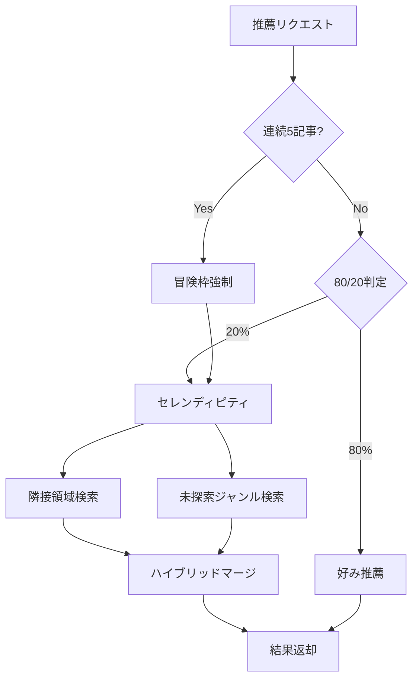

# Subtask 004-02-02: セレンディピティ実装

## 概要

80/20の比率で「好み推薦」と「セレンディピティ枠」を切り替える機能を実装する。セレンディピティ枠では**隣接領域**と**未探索ジャンル**のハイブリッド方式で新しい発見を提供する。

## ステータス

- **status**: pending

## ユーザーストーリー

**As a** SCPファン
**I want** たまに意外な記事を推薦してほしい
**So that** 新しいジャンルを発見できる

## Acceptance Criteria（EARS記法）

- [ ] WHEN 推薦を行う際
      THEN 80%の確率で好みに類似した記事を推薦する（Exploitation）
      AND 20%の確率でセレンディピティ枠から推薦する（Exploration）

- [ ] WHEN セレンディピティ枠から推薦する際
      THEN 以下の2方式をハイブリッドで選出する: - 隣接領域: 嗜好ベクトルから「少し離れた」記事（類似度0.4〜0.7）- 未探索ジャンル: ユーザーがまだ読んでいないタグを持つ記事

- [ ] WHEN 隣接領域から選出する際
      THEN 嗜好ベクトルとのコサイン類似度が0.4〜0.7の範囲の記事を選ぶ
      AND 類似度が高い順にソートする

- [ ] WHEN 未探索ジャンルから選出する際
      THEN ユーザーの閲覧履歴に含まれないタグを持つ記事を選ぶ
      AND 人気度（rating）が高い記事を優先する

- [ ] WHEN 推薦結果を返す際
      THEN source フィールドで "preference" か "serendipity" かを識別できる

## 技術設計

### セレンディピティ選出ロジック

```typescript
// packages/shared/src/recommendation/serendipity.ts

export interface SerendipityConfig {
  /** セレンディピティ比率（デフォルト: 0.2 = 20%） */
  explorationRate: number;

  /** 隣接領域の最小類似度（デフォルト: 0.4） */
  adjacentMinSimilarity: number;

  /** 隣接領域の最大類似度（デフォルト: 0.7） */
  adjacentMaxSimilarity: number;

  /** 隣接領域 vs 未探索ジャンルの比率（デフォルト: 0.5 = 50:50） */
  adjacentRatio: number;
}

export const DEFAULT_SERENDIPITY_CONFIG: SerendipityConfig = {
  explorationRate: 0.2,
  adjacentMinSimilarity: 0.4,
  adjacentMaxSimilarity: 0.7,
  adjacentRatio: 0.5,
};

/**
 * セレンディピティ記事を取得
 */
export async function getSerendipityArticles(
  preferenceEmbedding: number[],
  excludeIds: string[],
  exploredTags: string[],
  vectorSearch: VectorSearchClient,
  config: SerendipityConfig = DEFAULT_SERENDIPITY_CONFIG,
  limit: number = 10
): Promise<RecommendedArticle[]> {
  const adjacentCount = Math.ceil(limit * config.adjacentRatio);
  const unexploredCount = limit - adjacentCount;

  const [adjacentArticles, unexploredArticles] = await Promise.all([
    getAdjacentArticles(preferenceEmbedding, excludeIds, vectorSearch, config, adjacentCount),
    getUnexploredArticles(exploredTags, excludeIds, vectorSearch, unexploredCount),
  ]);

  // 重複を除去してマージ
  const seen = new Set<string>();
  const results: RecommendedArticle[] = [];

  for (const article of [...adjacentArticles, ...unexploredArticles]) {
    if (!seen.has(article.id)) {
      seen.add(article.id);
      results.push({
        ...article,
        source: "serendipity" as const,
      });
    }
  }

  return results.slice(0, limit);
}

/**
 * 隣接領域から記事を取得
 *
 * 嗜好ベクトルから「少し離れた」記事を検索。
 * 完全に異質ではないが、普段とは違う記事を提供。
 */
async function getAdjacentArticles(
  preferenceEmbedding: number[],
  excludeIds: string[],
  vectorSearch: VectorSearchClient,
  config: SerendipityConfig,
  limit: number
): Promise<RecommendedArticle[]> {
  const results = await vectorSearch.searchByEmbedding({
    queryVector: preferenceEmbedding,
    excludeIds,
    limit: limit * 2, // 余裕を持って取得
    minSimilarity: config.adjacentMinSimilarity,
    maxSimilarity: config.adjacentMaxSimilarity,
  });

  return results.slice(0, limit).map((r) => ({
    id: r.id,
    title: r.title,
    similarityScore: r.similarity,
    source: "serendipity" as const,
  }));
}

/**
 * 未探索ジャンルから記事を取得
 *
 * ユーザーがまだ読んでいないタグを持つ記事を検索。
 * 完全に新しいジャンルへの入口を提供。
 */
async function getUnexploredArticles(
  exploredTags: string[],
  excludeIds: string[],
  vectorSearch: VectorSearchClient,
  limit: number
): Promise<RecommendedArticle[]> {
  // 未探索タグを持つ記事を人気順で取得
  const results = await vectorSearch.searchByUnexploredTags({
    exploredTags,
    excludeIds,
    limit,
    orderBy: "rating",
  });

  return results.map((r) => ({
    id: r.id,
    title: r.title,
    similarityScore: 0, // 未探索なので類似度は0
    source: "serendipity" as const,
  }));
}
```

### VectorSearchClient 拡張

```typescript
// packages/shared/src/search/vector-search-client.ts に追加

export interface UnexploredTagsSearchParams {
  /** ユーザーが既に触れたタグ */
  exploredTags: string[];
  /** 除外する記事ID */
  excludeIds?: string[];
  /** 取得件数 */
  limit: number;
  /** ソート基準 */
  orderBy: "rating" | "random";
}

export interface VectorSearchClient {
  // 既存メソッド...

  /**
   * 未探索タグを持つ記事を検索
   */
  searchByUnexploredTags(params: UnexploredTagsSearchParams): Promise<VectorSearchResult[]>;
}
```

### エンジンへの統合

```typescript
// RecommendationEngine に統合

async getRecommendations(
  visitorId: string,
  limit: number = 10
): Promise<RecommendedArticle[]> {
  // ... 嗜好ベクトル取得 ...

  // 連続類似検出（004-02-03で実装）
  if (await this.shouldForceSerendipity(visitorId)) {
    return this.getSerendipityRecommendations(profile, excludedIds, limit);
  }

  // 80/20 判定
  const isSerendipity = Math.random() < this.config.explorationRate;

  if (isSerendipity) {
    return this.getSerendipityRecommendations(profile, excludedIds, limit);
  } else {
    return this.getPreferenceRecommendations(profile, excludedIds, limit);
  }
}

private async getSerendipityRecommendations(
  profile: PreferenceProfile,
  excludedIds: string[],
  limit: number
): Promise<RecommendedArticle[]> {
  const exploredTags = await this.getExploredTags(profile.visitorId);

  return getSerendipityArticles(
    profile.preferenceEmbedding!,
    excludedIds,
    exploredTags,
    this.vectorSearch,
    this.serendipityConfig,
    limit
  );
}

private async getExploredTags(visitorId: string): Promise<string[]> {
  const viewHistory = await this.storage.getViewHistory(visitorId);
  const allTags: string[] = [];

  for (const vh of viewHistory) {
    const tags = await this.storage.getArticleTags(vh.articleId);
    if (tags) {
      allTags.push(...tags);
    }
  }

  return [...new Set(allTags)];
}
```

### データフロー



## テストケース

- [ ] explorationRate=0.2 の場合、約20%の確率でセレンディピティが選ばれる
- [ ] 隣接領域記事は類似度0.4〜0.7の範囲から選ばれる
- [ ] 未探索ジャンル記事はユーザーが読んでいないタグを持つ
- [ ] 隣接領域と未探索ジャンルが適切な比率でマージされる
- [ ] 返却されるarticleのsourceが"serendipity"に設定される
- [ ] 除外IDリストが正しく適用される
- [ ] 重複記事が除去される

## 成果物

- `packages/shared/src/recommendation/serendipity.ts`
- `packages/shared/src/recommendation/__tests__/serendipity.test.ts`
- `packages/shared/src/recommendation/engine.ts`（統合）

## 依存関係

- 004-02-01: 推薦エンジンコア
