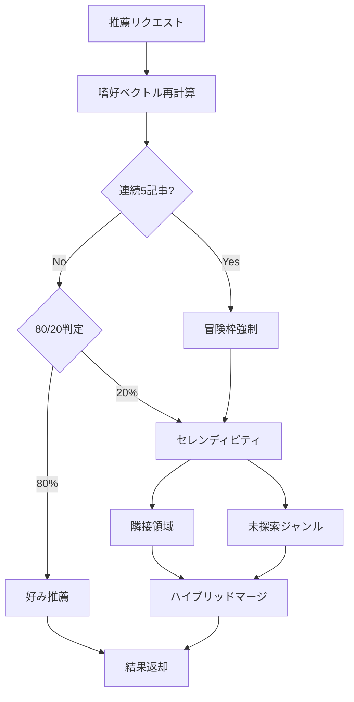

# Story 004-02: 推薦エンジン

## 概要

**Embeddingベースの嗜好ベクトル**を使用した推薦エンジンのコア機能を実装する。80/20のセレンディピティ比率（隣接領域+未探索ジャンル）と連続類似検出機能を含む。

## ステータス

- **status**: pending

## ユーザーストーリー

**As a** SCPファン
**I want** 自分の好みに合った記事と、たまに意外な記事を推薦してほしい
**So that** 飽きずに新しい発見ができる

## Acceptance Criteria（Story レベル）

### AC-1: 推薦エンジンコア

- [ ] WHEN ユーザーが次の記事をリクエストした際
      GIVEN ユーザーの嗜好ベクトル（preferenceEmbedding）が存在する場合
      THEN システムはコサイン類似度で推薦候補を取得する
      AND 既読・Dislike済み・お気に入り済み記事を除外する

### AC-2: セレンディピティ

- [ ] WHEN 推薦を行う際
      THEN 80%の確率で好みに類似した記事を推薦する
      AND 20%の確率でセレンディピティ枠（隣接領域+未探索ジャンル）から推薦する

### AC-3: 連続類似検出

- [ ] WHEN ユーザーが連続で5記事以上類似記事を閲覧した際
      THEN 次の1記事は必ず「冒険枠」から選出する

## Subtask 一覧

| ID                          | 名前             | 概要                        | ステータス |
| --------------------------- | ---------------- | --------------------------- | ---------- |
| [004-02-01](./004-02-01.md) | 推薦エンジンコア | Embeddingベース推薦エンジン | completed  |
| [004-02-02](./004-02-02.md) | セレンディピティ | 隣接領域+未探索ジャンル     | completed  |
| [004-02-03](./004-02-03.md) | 連続類似検出     | 連続5記事で冒険枠強制       | pending    |

## 技術設計

### 推薦アルゴリズム

```typescript
// packages/shared/src/recommendation/engine.ts

export class RecommendationEngine {
  constructor(
    private storage: PreferenceStorage,
    private vectorSearch: VectorSearchClient,
    private config: RecommendationEngineConfig
  ) {}

  async getRecommendations(visitorId: string): Promise<RecommendedArticle[]> {
    // 嗜好ベクトルを即時再計算
    await this.recalculatePreferenceVector(visitorId);

    const profile = await this.storage.getProfile(visitorId);
    const excluded = await this.getExcludedIds(visitorId);

    // 連続類似検出
    if (await this.shouldForceSerendipity(visitorId)) {
      return this.getSerendipityRecommendations(profile, excluded);
    }

    // 80/20 判定
    const isSerendipity = Math.random() < 0.2;

    if (isSerendipity) {
      return this.getSerendipityRecommendations(profile, excluded);
    } else {
      return this.getPreferenceRecommendations(profile, excluded);
    }
  }
}
```

### データフロー



### 嗜好ベクトル計算

```typescript
// シグナル別重み
const SIGNAL_WEIGHTS = {
  favorite: 2.0, // お気に入り（最強）
  like: 1.0, // Like
  view: 0.3, // 読了
  dislike: -0.5, // Dislike（負の重み）
};

// 重み付け平均でベクトル生成
preferenceEmbedding = weightedAverage([
  ...favoriteArticleEmbeddings.map((e) => ({ vector: e, weight: 2.0 })),
  ...likedArticleEmbeddings.map((e) => ({ vector: e, weight: 1.0 })),
  ...viewedArticleEmbeddings.map((e) => ({ vector: e, weight: 0.3 })),
  ...dislikedArticleEmbeddings.map((e) => ({ vector: e, weight: -0.5 })),
]);
```

## 依存関係

- 004-01: 推薦基盤（ストレージ・プロファイル）
- 004-01-05: 嗜好ベクトル計算
- 004-01-06: お気に入り機能
- 004-03: オンボーディング（初期プロファイル）

## 成果物

- `packages/shared/src/recommendation/engine.ts`
- `packages/shared/src/recommendation/serendipity.ts`
- `packages/shared/src/recommendation/preference-vector.ts`
- `packages/shared/src/search/vector-search-client.ts`
