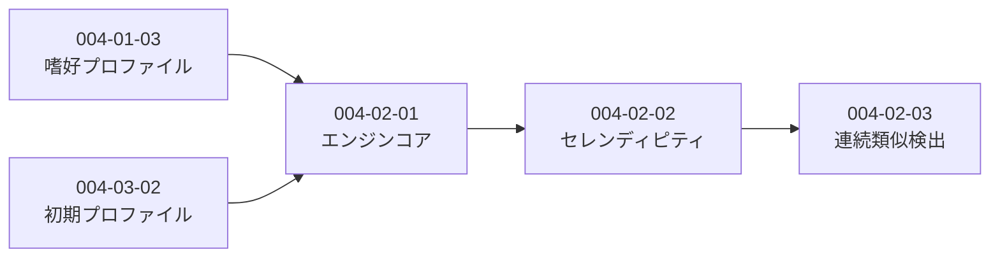

# Subtask 一覧 - Story 004-02: 推薦エンジン

| ID                          | 名前             | 概要                          | ステータス | 依存                  |
| --------------------------- | ---------------- | ----------------------------- | ---------- | --------------------- |
| [004-02-01](./004-02-01.md) | 推薦エンジンコア | RecommendationEngineクラス    | pending    | 004-01-03, 004-03-02  |
| [004-02-02](./004-02-02.md) | セレンディピティ | 80/20比率での推薦切り替え     | pending    | 004-02-01             |
| [004-02-03](./004-02-03.md) | 連続類似検出     | 連続5記事で冒険枠強制         | pending    | 004-02-02             |

## 依存関係図

