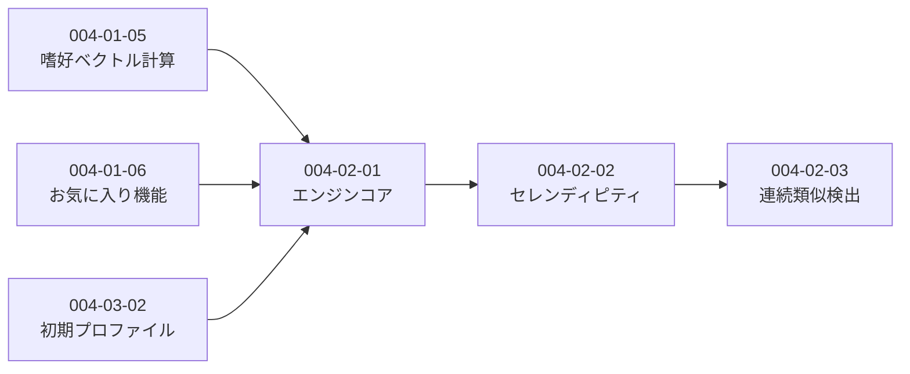

# Subtask 一覧 - Story 004-02: 推薦エンジン

| ID                          | 名前             | 概要                        | ステータス | 依存                            |
| --------------------------- | ---------------- | --------------------------- | ---------- | ------------------------------- |
| [004-02-01](./004-02-01.md) | 推薦エンジンコア | Embeddingベース推薦エンジン | pending    | 004-01-05, 004-01-06, 004-03-02 |
| [004-02-02](./004-02-02.md) | セレンディピティ | 隣接領域+未探索ジャンル     | pending    | 004-02-01                       |
| [004-02-03](./004-02-03.md) | 連続類似検出     | 連続5記事で冒険枠強制       | pending    | 004-02-02                       |

## 依存関係図

## 実装順序

### 前提条件（別Storyで実装）

- ✅ 004-03-02: 初期プロファイル構築（completed）
- ⏳ 004-01-06: お気に入り機能（pending）
- ⏳ 004-01-05: 嗜好ベクトル計算（pending）

### このStoryの実装順序

1. **004-02-01: 推薦エンジンコア** ← 前提条件完了後に開始
2. **004-02-02: セレンディピティ**
3. **004-02-03: 連続類似検出**

## 設計方針

### Embeddingベース推薦

- 嗜好ベクトル（preferenceEmbedding）を基準にコサイン類似度で検索
- シグナル別重み: お気に入り(2.0) > Like(1.0) > 読了(0.3)
- Dislikeは負の重み(-0.5)で「避けるべき方向」として反映

### セレンディピティ（冒険枠）

- 80:20の比率で好み推薦とセレンディピティを切り替え
- セレンディピティ枠は2方式のハイブリッド:
  - **隣接領域**: 類似度0.4〜0.7の「少し離れた」記事
  - **未探索ジャンル**: ユーザーが読んでいないタグの記事
