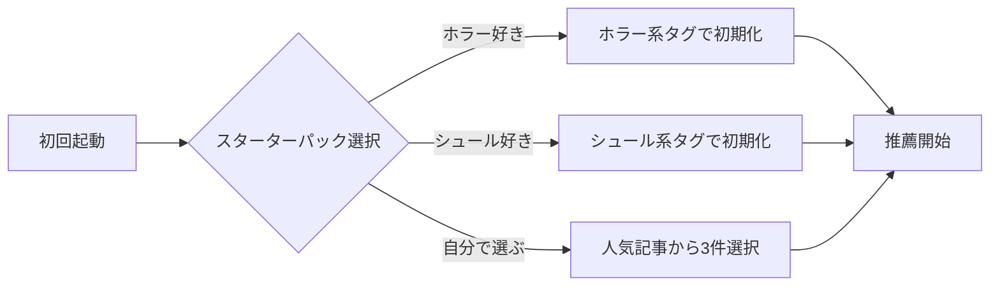

# Story 004-03: オンボーディング

## 概要

新規ユーザー向けのオンボーディングフローを実装する。スターターパック選択式で初期プロファイルを構築し、即座に推薦を開始できるようにする。

## ステータス

- **status**: pending

## ユーザーストーリー

**As a** 新規ユーザー
**I want** 簡単な選択で自分の好みを伝えたい
**So that** すぐにパーソナライズされた推薦を受けられる

## Acceptance Criteria（Story レベル）

### AC-1: スターターパック選択

- [ ] WHEN 新規ユーザーが初回起動した際
      THEN システムはスターターパック選択画面を表示する
      AND 5種類のパック + 「自分で選ぶ」オプションを提供する

### AC-2: 初期プロファイル構築

- [ ] WHEN ユーザーがスターターパックを選択した際
      THEN システムは選択に基づいて初期プロファイルを構築する
      AND 即座に推薦を開始できる状態になる

### AC-3: カスタム選択

- [ ] WHEN ユーザーが「自分で選ぶ」を選択した際
      THEN 人気記事一覧から3件以上選択させる
      AND 選択した記事からプロファイルを構築する

## Subtask 一覧

| ID                          | 名前               | 概要                          | ステータス |
| --------------------------- | ------------------ | ----------------------------- | ---------- |
| [004-03-01](./004-03-01.md) | スターターパック定義 | 5種類のパック定義・代表記事   | pending    |
| [004-03-02](./004-03-02.md) | 初期プロファイル構築 | パック選択から初期嗜好生成    | pending    |

## 技術設計

### スターターパック定義

| パック名 | 代表タグ | 初期記事例 |
|----------|----------|-----------|
| ホラー好き | horror, creepy | SCP-087, SCP-106 |
| シュール好き | surreal, humorous | SCP-426, SCP-999 |
| 科学・SF好き | scientific, technological | SCP-914, SCP-2000 |
| ほのぼの好き | heartwarming, safe | SCP-999, SCP-131 |
| 謎解き好き | mystery, puzzle | SCP-001, SCP-055 |

### オンボーディングフロー

## 依存関係

- 004-01: 推薦基盤（ストレージ・プロファイル計算）

## 成果物

- `packages/shared/src/onboarding/starter-packs.ts`
- `packages/shared/src/onboarding/types.ts`
