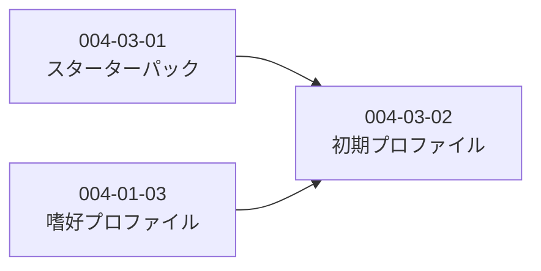

# Subtask 一覧 - Story 004-03: オンボーディング

| ID                          | 名前                 | 概要                        | ステータス | 依存                 |
| --------------------------- | -------------------- | --------------------------- | ---------- | -------------------- |
| [004-03-01](./004-03-01.md) | スターターパック定義 | 5種類のパック定義・代表記事 | pending    | -                    |
| [004-03-02](./004-03-02.md) | 初期プロファイル構築 | パック選択から初期嗜好生成  | pending    | 004-01-03, 004-03-01 |

## 依存関係図

