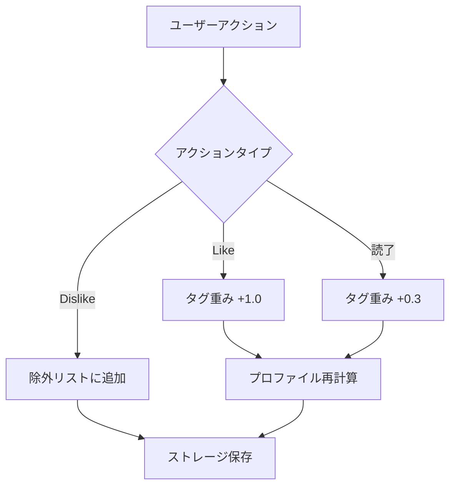

# Story 004-04: シグナル処理

## 概要

ユーザーのフィードバック（Like/Dislike）と閲覧履歴を収集・処理し、嗜好プロファイルを更新する機能を実装する。

## ステータス

- **status**: completed

## ユーザーストーリー

**As a** 推薦システム
**I want** ユーザーの行動シグナルを収集・処理できる
**So that** 推薦精度を継続的に向上させられる

## Acceptance Criteria（Story レベル）

### AC-1: Like/Dislikeフィードバック

- [x] WHEN ユーザーが記事をLikeした際
      THEN その記事のタグに対する重みが増加する
      AND プロファイルが更新される

- [x] WHEN ユーザーが記事をDislikeした際
      THEN その記事が除外リストに追加される
      AND タグ重みは変化しない

### AC-2: 閲覧履歴

- [x] WHEN ユーザーが記事を閲覧した際
      THEN 閲覧履歴がストレージに記録される
      AND 滞在時間が記録される（可能な場合）

- [x] WHEN ユーザーが記事を最後まで読んだ（Likeなし）際
      THEN 弱い正のシグナルとしてタグ重みが微増する

## Subtask 一覧

| ID                          | 名前                       | 概要                                 | ステータス |
| --------------------------- | -------------------------- | ------------------------------------ | ---------- |
| [004-04-01](./004-04-01.md) | Like/Dislikeフィードバック | フィードバック記録・プロファイル更新 | completed  |
| [004-04-02](./004-04-02.md) | 閲覧履歴・読了シグナル     | 閲覧記録・弱い正シグナル処理         | completed  |

## 技術設計

### シグナル重み

| アクション       | 重み増分 | 備考                               |
| ---------------- | -------- | ---------------------------------- |
| Like             | +1.0     | 強い正のシグナル                   |
| 読了（Likeなし） | +0.3     | 弱い正のシグナル                   |
| Dislike          | 0        | タグ重みには影響しない（除外のみ） |

### シグナル処理フロー

## 依存関係

- 004-01: 推薦基盤（ストレージ・プロファイル計算）

## 成果物

- `packages/shared/src/recommendation/signal-processor.ts`
