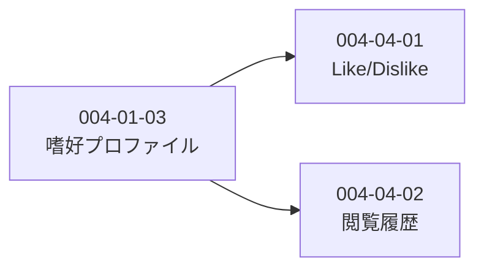

# Subtask 一覧 - Story 004-04: シグナル処理

| ID                          | 名前                       | 概要                                 | ステータス | 依存      |
| --------------------------- | -------------------------- | ------------------------------------ | ---------- | --------- |
| [004-04-01](./004-04-01.md) | Like/Dislikeフィードバック | フィードバック記録・プロファイル更新 | completed  | 004-01-03 |
| [004-04-02](./004-04-02.md) | 閲覧履歴・読了シグナル     | 閲覧記録・弱い正シグナル処理         | completed  | 004-01-03 |

## 依存関係図

