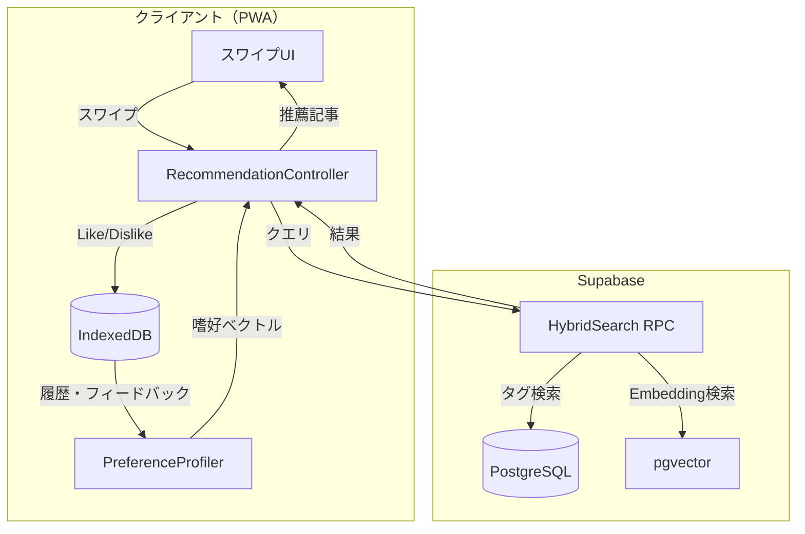

# EPIC-004: 推薦ロジック実装

## 概要

ハイブリッド推薦方式（Embedding + タグ）による推薦ロジックを実装し、ユーザーの嗜好に基づいた SCP 記事のレコメンデーションを実現する。

## ステータス

- **status**: in_progress

## ユーザーストーリー

**ペルソナ**: SCPファンだが大量の記事を追いきれないユーザー
**目的**: 自分の好みに合ったSCP記事を効率的に発見する
**価値**: 限られた時間で満足度の高い読書体験を得られる
**理由**: 数千件以上のSCP記事から自力で好みを探すのは困難

## 背景

- ユーザー登録なしで利用可能にする（ゲスト利用）
- 嗜好データはクライアントサイド（IndexedDB）に保存
- Web PWA → Capacitor への移行パスを考慮

## 主要機能

### 1. ハイブリッド推薦

- **Embedding類似度**: 記事全体のベクトル化による意味的類似度
- **明示的タグ**: オブジェクトクラス、テーマ、GoI関連等
- **協調フィルタリング**: ユーザー行動（スワイプ履歴）- MVP後に実装

### 2. 探索と活用のバランス（Exploration vs Exploitation）

- **80%**: ユーザーの好みに類似した記事（Exploitation）
- **20%**: セレンディピティ枠（Exploration）
- **連続5記事ルール**: 類似記事が連続5件 → 次は必ず「冒険枠」

### 3. オンボーディング

- スターターパック選択式（ホラー好き、シュール好き等）
- 選択結果から初期プロファイルを構築
- 「自分で選ぶ」オプションも提供

### 4. シグナル処理

- **Like**: 強い正のシグナル → 類似記事の推薦優先度を上げる
- **読了（Likeなし）**: 弱い正のシグナル
- **Dislike**: 「今はいらない」扱い、記事単体を除外（類似は除外しない）

## Acceptance Criteria（EPIC レベル）

### AC-1: ハイブリッド推薦

- [ ] WHEN ユーザーが次の記事をリクエストした際
      GIVEN ユーザープロファイルが存在する場合
      THEN システムはEmbedding類似度とタグマッチングを組み合わせて推薦する
      AND 80%は好みに類似した記事、20%はセレンディピティ枠から選出する

### AC-2: 連続類似検出

- [ ] WHEN ユーザーが連続で5記事以上類似記事を閲覧した際
      THEN システムは次の1記事を必ず「冒険枠」から選出する

### AC-3: オンボーディング

- [ ] WHEN 新規ユーザーが初回起動した際
      THEN システムはスターターパック選択画面を表示する
      AND 選択に基づいて初期プロファイルを構築する

### AC-4: シグナル処理

- [ ] WHEN ユーザーが記事をLike/Dislikeした際
      THEN システムはフィードバックを記録する
      AND 推薦ロジックに反映する

## Story 一覧

| ID                                                | 名前             | 概要                               | ステータス |
| ------------------------------------------------- | ---------------- | ---------------------------------- | ---------- |
| [004-01](./004-01-recommend-foundation/004-01.md) | 推薦基盤         | ストレージ・IndexedDB・嗜好計算    | pending    |
| [004-02](./004-02-recommend-engine/004-02.md)     | 推薦エンジン     | コア推薦ロジック・セレンディピティ | pending    |
| [004-03](./004-03-onboarding/004-03.md)           | オンボーディング | スターターパック・初期プロファイル | pending    |
| [004-04](./004-04-signal-processing/004-04.md)    | シグナル処理     | Like/Dislike・閲覧履歴             | pending    |

## 技術設計

### データフロー



### パッケージ構成

```
packages/
├── shared/
│   ├── src/
│   │   ├── recommendation/          # 推薦エンジン
│   │   │   ├── engine.ts
│   │   │   ├── serendipity.ts
│   │   │   ├── profiler.ts
│   │   │   └── types.ts
│   │   ├── storage/                 # ストレージ層
│   │   │   ├── indexed-db.ts
│   │   │   ├── preference-store.ts
│   │   │   └── types.ts
│   │   └── onboarding/              # オンボーディング
│   │       ├── starter-packs.ts
│   │       └── types.ts
│   └── dist/                        # ビルド成果物
│       ├── recommendation/
│       ├── storage/
│       └── onboarding/
```

### 計算方式（段階的）

| フェーズ | 方式         | トリガー                    |
| -------- | ------------ | --------------------------- |
| MVP      | リアルタイム | -                           |
| 中期     | ハイブリッド | DAU 100人 or レスポンス劣化 |
| 成熟期   | 専用インフラ | DAU 1,000人超               |

## MVP範囲

| 機能                  | MVP       | 将来             |
| --------------------- | --------- | ---------------- |
| Embedding + タグ推薦  | o         | -                |
| 協調フィルタリング    | x         | ユーザー500人〜  |
| Like/Dislikeシグナル  | o（基本） | 重み付け強化     |
| スターターパック      | o         | カテゴリ拡充     |
| 80/20セレンディピティ | o（固定） | 動的調整         |
| リアルタイム計算      | o         | ハイブリッド移行 |
| 長さの考慮            | x         | 可処分時間対応   |

## 依存関係

- **EPIC-003**: データパイプライン本番化（記事データ・タグデータが必要）

## 参照ドキュメント

- `.claude/NOTES.md` > `## EPIC-004: ユーザー嗜好データのストレージ設計`
