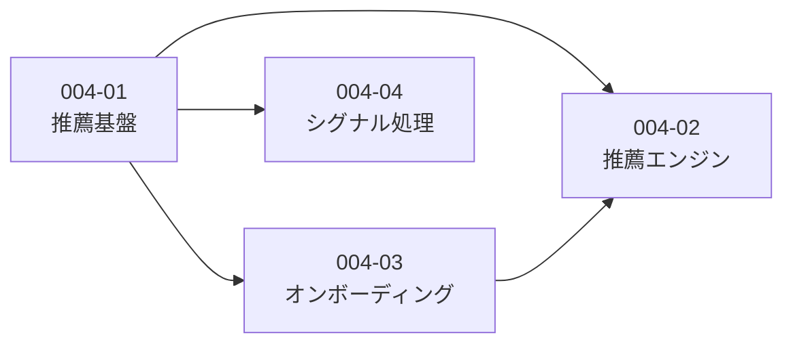

# Story 一覧 - EPIC-004: 推薦ロジック実装

| ID                                                | 名前             | 概要                               | ステータス  | 依存   |
| ------------------------------------------------- | ---------------- | ---------------------------------- | ----------- | ------ |
| [004-01](./004-01-recommend-foundation/004-01.md) | 推薦基盤         | ストレージ・IndexedDB・嗜好計算    | in_progress | -      |
| [004-02](./004-02-recommend-engine/004-02.md)     | 推薦エンジン     | コア推薦ロジック・セレンディピティ | pending     | 004-01 |
| [004-03](./004-03-onboarding/004-03.md)           | オンボーディング | スターターパック・初期プロファイル | completed   | 004-01 |
| [004-04](./004-04-signal-processing/004-04.md)    | シグナル処理     | Like/Dislike・閲覧履歴             | completed   | 004-01 |

## 依存関係図

## 実装順序

### 完了済み

1. ~~**004-01-01〜04** 推薦基盤（基礎）~~ ✅
2. ~~**004-03** オンボーディング~~ ✅
3. ~~**004-04** シグナル処理~~ ✅

### 残タスク（推奨順序）

4. **004-01-06** お気に入り機能 ← 次はここから
5. **004-01-05** 嗜好ベクトル計算
6. **004-02-01** 推薦エンジンコア
7. **004-02-02** セレンディピティ
8. **004-02-03** 連続類似検出

> **Note**: 004-01-05/06 は clarify で追加された新規Subtask。
> 004-02 開始前にこれらを完了する必要あり。

## 参照ドキュメント

- `.claude/NOTES.md` > `## EPIC-004: ユーザー嗜好データのストレージ設計`
