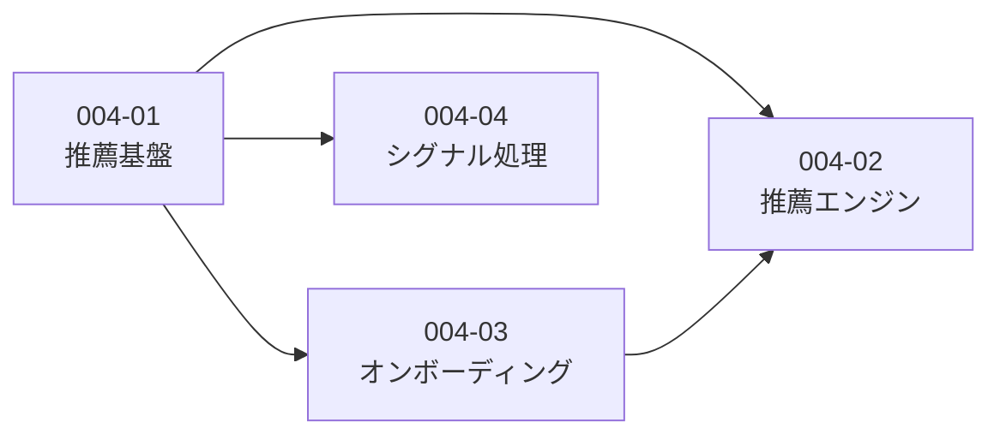

# Story 一覧 - EPIC-004: 推薦ロジック実装

| ID                                                | 名前             | 概要                               | ステータス | 依存   |
| ------------------------------------------------- | ---------------- | ---------------------------------- | ---------- | ------ |
| [004-01](./004-01-recommend-foundation/004-01.md) | 推薦基盤         | ストレージ・IndexedDB・嗜好計算    | completed  | -      |
| [004-02](./004-02-recommend-engine/004-02.md)     | 推薦エンジン     | コア推薦ロジック・セレンディピティ | pending    | 004-01 |
| [004-03](./004-03-onboarding/004-03.md)           | オンボーディング | スターターパック・初期プロファイル | pending    | 004-01 |
| [004-04](./004-04-signal-processing/004-04.md)    | シグナル処理     | Like/Dislike・閲覧履歴             | pending    | 004-01 |

## 依存関係図

## 実装順序

1. **004-01 推薦基盤** - ストレージ層が全ての基盤
2. **004-03 オンボーディング** - 初期プロファイル構築（004-02の前提）
3. **004-04 シグナル処理** - フィードバック収集（004-02と並行可能）
4. **004-02 推薦エンジン** - コア機能（004-01, 004-03に依存）

## 参照ドキュメント

- `.claude/NOTES.md` > `## EPIC-004: ユーザー嗜好データのストレージ設計`
