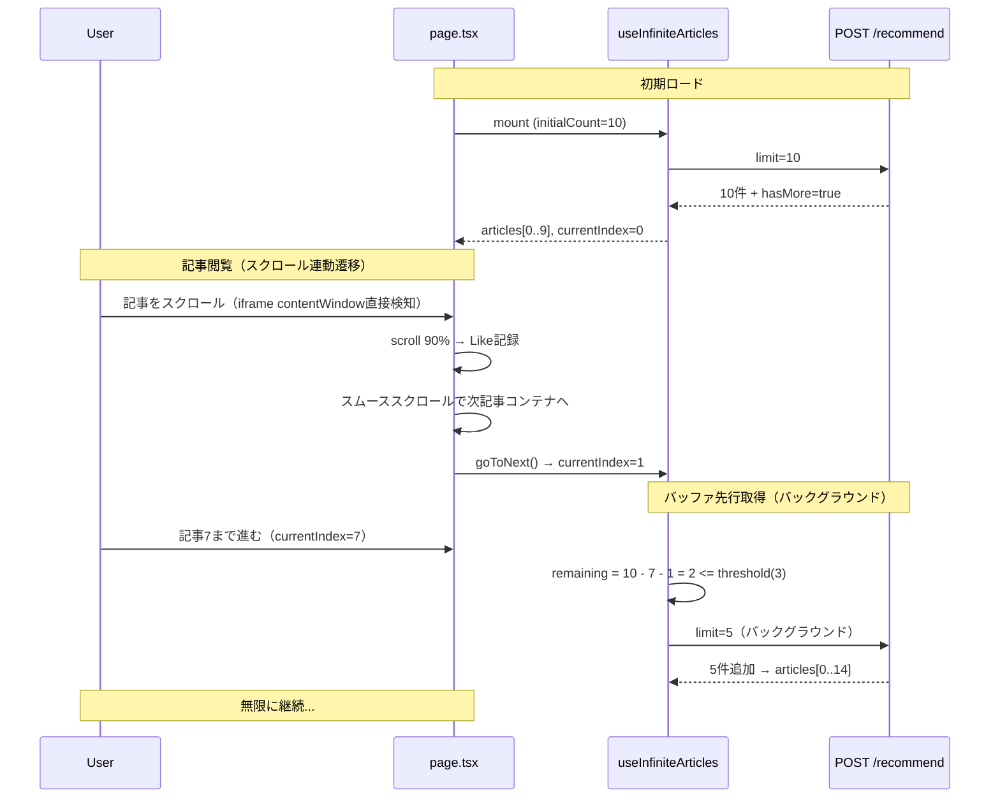

# Subtask 006-02-07: 推薦拡張・無限スクロール強化

## 概要

推薦記事の初期取得件数を3件から10件に拡大し、バッファベースの先行取得と
スクロール連動の滑らかな遷移アニメーションを実装する。
ユーザーが途切れることなく記事を読み続けられる体験を提供する。

## ステータス

- **status**: completed

## 親Story

[006-02: 記事閲覧](./006-02.md)

## ユーザーストーリー

**ペルソナ**: SCPファン
**目的**: 推薦画面で途切れることなく記事を読み続ける
**価値**: スクロールするだけで次の記事が滑らかに現れ、いつまでも読み続けられる
**理由**: 3件では少なく、読み終わるたびに途切れる体験を解消したい

> SCPファンとして、推薦画面で途切れることなく記事を読み続けたい。スクロールするだけで次の記事が滑らかに現れ、いつまでも読み続けられる体験を得たい。

## 背景

### 現状の課題

| 項目             | 現行値           | 問題点                                       |
| ---------------- | ---------------- | -------------------------------------------- |
| 初期取得件数     | 3件              | 少なく、すぐに追加取得が発生する             |
| 追加取得件数     | 1件ずつ          | 取得頻度が高く、待ち時間が頻繁に発生する     |
| 自動読み込み上限 | 10回で一時停止   | 読書体験が中断される                         |
| 遷移方式         | カード差し替え   | 記事間の遷移に滑らかさがない                 |
| バッファ管理     | なし（都度取得） | 先読みがないため、次記事表示に待ちが発生する |

### /clarify からの決定事項

- UXモデル: カード順送り方式を維持 + スクロール連動の滑らかな自動遷移
- 10件: バッファとして事前取得（表示は1枚ずつ）
- 追加トリガー: バッファ残数ベースで自動追加取得
- 遷移: 記事下部到達時に下にスクロールすると次記事がスルッと現れる
- 「次へ」ボタン: 既存のまま維持
- Like記録: 下部到達 = 暗黙的Like（既存挙動維持）
- API: 変更不要（既にlimit=1-50対応済み）

## Acceptance Criteria（EARS記法）

### AC-1: 初期ロード件数の拡大

- [x] WHEN ユーザーが推薦画面を初回表示した際
      GIVEN POST /recommend APIを呼び出す場合
      THEN limit=10で1回のAPI呼び出しで10件取得する
      AND 最初の記事がWebViewで表示される

### AC-2: バッファベースの先行取得

- [x] WHEN 未表示の記事バッファ残数が3件以下になった際
      GIVEN hasMoreがtrueでかつ取得中でない場合
      THEN バックグラウンドで追加の推薦記事を5件自動取得する
      AND ユーザーにローディング表示を見せない

### AC-3: 自動読み込み上限の撤廃

- [x] WHEN 連続読み込み回数が10回を超えた際
      THEN 自動読み込みを一時停止しない（既存AC-5の上書き）
      AND hasMoreがtrueである限り無限に読み続けられる

### AC-4: スクロール連動の滑らかな遷移

- [x] WHEN ユーザーが現在の記事の最下部までスクロールした際
      THEN 次の記事が画面下部からスライドインで表示される
      AND CSSスムーススクロール（scroll-behavior: smooth）が適用される
      AND スクロール位置が記事境界でジャンプしない（scrollTop値が連続的に変化する）

### AC-5: 既存「次へ」ボタンの維持

- [x] WHEN ユーザーが「次へ」ボタン（ピルナビの→）をタップした際
      THEN 次の記事に即座に遷移する（既存挙動を維持）
      AND 暗黙的スキップフィードバック（type="skip" + interest_level）が記録される（006-05-06で変更）

### AC-6: 下部到達時の挙動（仕様変更済み）

- [x] WHEN ユーザーが記事最下部に到達した際
      THEN 自動遷移は発生しない（006-05-07 AC-7で廃止）
      AND 自動Like記録は発生しない
      AND スクロール深度はメタデータとして記録され、「次へ」タップ時のフィードバックに利用される

### AC-7: バッファ先行取得失敗時のリトライ

- [x] WHEN バックグラウンド取得が失敗した際
      THEN ユーザーの閲覧体験を中断しない
      AND エラーをログに記録する
      AND 次の記事遷移時に再度取得を試みる

### AC-8: 過去記事のメモリ解放

- [x] WHEN 新しい記事に遷移した際
      THEN 現在表示中の記事 + 次の1記事のみDOMに保持する
      AND それ以前の記事のiframeを破棄する

### AC-9: 遷移中の操作制御

- [x] WHILE スクロール遷移アニメーション中の間
      THE SYSTEM SHALL 「次へ」ボタンの連打を防止する
      AND アニメーション完了後に次の操作を受け付ける

## Breaking Changes

このSubtaskは006-02-04のインターフェースに破壊的変更を加えます。

**削除される機能:**

- `isPaused: boolean` - 自動読み込み一時停止フラグ
- `resumeAutoLoad: () => void` - 再開関数
- `autoLoadLimit: number` - オプション

**影響範囲:**

- `useInfiniteArticles` を使用している全てのコンポーネント
- 006-02-04で実装された自動読み込み上限機能に依存するコード

**移行方法:**

- `isPaused` を参照しているコードを削除
- `resumeAutoLoad` の呼び出しを削除
- 無限スクロールは制限なく動作するため、代替実装は不要

## 技術設計

### 変更対象ファイル

| ファイル                                       | 変更内容                                      |
| ---------------------------------------------- | --------------------------------------------- |
| `_hooks/useInfiniteArticles.ts`                | 定数変更、バッファ先行取得、autoLoadLimit撤廃 |
| `_hooks/__tests__/useInfiniteArticles.test.ts` | テストケース更新                              |
| `page.tsx`                                     | デュアルWebView + スムーストランジション      |

### useInfiniteArticles 変更詳細

```typescript
// 定数変更
const DEFAULT_INITIAL_COUNT = 10; // 3 → 10
const DEFAULT_LOAD_MORE_COUNT = 5; // 1 → 5（バッチ取得）
const DEFAULT_PREFETCH_THRESHOLD = 3; // 新規: 残り3件で先行取得

// autoLoadLimit / isPaused / resumeAutoLoad → 削除

// Options変更
interface UseInfiniteArticlesOptions {
  initialCount?: number; // デフォルト: 10
  loadMoreCount?: number; // デフォルト: 5
  prefetchThreshold?: number; // 新規: デフォルト 3
}

// Result変更
interface UseInfiniteArticlesResult {
  articles: Article[];
  currentIndex: number;
  isLoading: boolean;
  isLoadingMore: boolean;
  error: Error | null;
  isEmpty: boolean;
  hasMore: boolean;
  // isPaused → 削除
  loadMore: () => Promise<void>;
  goToNext: () => void;
  // resumeAutoLoad → 削除
  reset: () => void;
  refetch: () => Promise<void>;
}
```

#### バッファ先行取得ロジック（新規）

```typescript
// currentIndex が進むたびに残数をチェック
useEffect(() => {
  const remaining = articles.length - currentIndex - 1;
  if (remaining <= prefetchThreshold && hasMore && !isLoadingMore) {
    void loadMore();
  }
}, [currentIndex, articles.length, hasMore, isLoadingMore, prefetchThreshold]);
```

### page.tsx デュアルWebView設計

```
┌────────────────────────────────────┐
│  Container (h-screen, overflow-y)  │
│  ┌──────────────────────────────┐  │
│  │  Current Article (iframe)    │  │  ← 表示中
│  │  height: calc(100vh - 100px) │  │
│  └──────────────────────────────┘  │
│  ┌──────────────────────────────┐  │
│  │  Next Article (iframe)       │  │  ← プリレンダリング
│  │  height: calc(100vh - 100px) │  │
│  └──────────────────────────────┘  │
└────────────────────────────────────┘
```

- 現在の記事 + 次の記事の2つのArticleWebViewを縦にスタック
- 現在の記事のスクロール90%到達（contentWindow直接アクセスによるスクロール検知）でコンテナをCSSスムーススクロール
- 遷移完了後、currentIndexを更新し、前の記事を破棄・次の記事をプリレンダリング

### データフロー図



### デュアルWebView方式のリスク評価

| リスク           | 影響                              | 対策                                       |
| ---------------- | --------------------------------- | ------------------------------------------ |
| メモリ消費増加   | 2つのiframeで2倍のメモリ使用      | 遷移完了後に前の記事のiframeを破棄（AC-8） |
| レンダリング負荷 | 次記事のプリレンダリングでCPU負荷 | 表示中+次の1記事のみDOM保持                |
| 複雑性増加       | 状態管理が複雑化                  | 遷移中の操作制御（AC-9）で競合を防止       |

**代替案との比較:**

| 方式                               | メリット                       | デメリット                     |
| ---------------------------------- | ------------------------------ | ------------------------------ |
| **採用: デュアルWebView**          | スムーズ遷移、プリレンダリング | メモリ消費、実装複雑性         |
| 代替: 単一WebView + コンテンツ切替 | シンプル、メモリ効率           | 遷移にローディング時間、UX劣化 |

**結論**: UX優先のため、デュアルWebViewを採用。メモリ対策として過去記事破棄（AC-8）を実装。

### 既存との整合性

| コンポーネント      | 影響                                                                 |
| ------------------- | -------------------------------------------------------------------- |
| ArticleWebView      | 変更なし。2インスタンス生成するだけ                                  |
| FloatingUI          | 変更なし。goToNextは既存通り動作                                     |
| useFeedback         | 変更なし。Like/Skip記録は既存通り（006-05-06でDislike→Skip変更済み） |
| useArticleFavorite  | 変更なし                                                             |
| POST /recommend API | 変更なし（既にlimit=1-50対応済み）                                   |

## テストケース

### useInfiniteArticles ユニットテスト

- [x] 初回読み込みでinitialCount=10件の記事が取得される
- [x] DEFAULT_INITIAL_COUNTが10であること
- [x] DEFAULT_LOAD_MORE_COUNTが5であること
- [x] バッファ残数がprefetchThreshold以下で自動追加取得される
- [x] バッファ残数がprefetchThresholdより多い場合は取得しない
- [x] loadMore()で5件ずつ追加記事が取得される
- [x] autoLoadLimitによる一時停止が発生しない（上限撤廃）
- [x] isPaused/resumeAutoLoadが存在しない（削除確認）
- [x] hasMoreがfalseの場合、先行取得は発生しない
- [x] 取得中にloadMore()を呼んでも重複リクエストしない

### page.tsx 結合テスト

- [x] 初期表示で最初の記事がWebViewに表示される
- [x] スクロール90%到達で次の記事にスムーススクロールで遷移する
- [x] スクロール遷移時にスクロール位置がジャンプしない（scrollTop値が連続的に変化する）
- [x] 遷移完了後にcurrentIndexが+1される
- [x] 遷移完了後に前の記事のiframeが破棄される（DOM上に2つ以下のiframe）
- [x] 「次へ」ボタンで次の記事に遷移する（既存挙動維持）
- [x] 「次へ」ボタン押下で暗黙的スキップフィードバックが記録される（006-05-06で変更）
- [x] 下部到達時に自動遷移・自動Like記録が発生しない（006-05-07 AC-7で廃止）
- [x] スクロール遷移中に「次へ」ボタン連打で二重遷移しない
- [x] バックグラウンド取得失敗時にエラー画面が表示されない

## デザイン準拠チェックリスト

**参照モック**: `mockups/header-6-minimal-2btn.html`

- [x] 遷移アニメーションが滑らかでジャンプしない
- [x] 既存のPillNav（♡ / →）が正常に表示・動作する
- [x] 既存のProgressBarが正常に表示・動作する
- [x] 既存のメニューボタン（☰）が正常に表示・動作する
- [x] ローディングインジケータが不要に表示されない

## 成果物

- `apps/web/src/app/(main)/recommend/_hooks/useInfiniteArticles.ts`（更新）
- `apps/web/src/app/(main)/recommend/_hooks/__tests__/useInfiniteArticles.test.ts`（更新）
- `apps/web/src/app/(main)/recommend/page.tsx`（更新）

## 依存関係

- 006-02-01: 記事閲覧ページ（変更対象）
- 006-02-04: 無限スクロールフック（変更対象・AC-5上書き）
- 006-02-02: WebViewコンポーネント（変更なし・利用）
- 006-02-03: フローティングUI（変更なし・利用）
- 006-02-05: フィードバック記録（変更なし・利用）
- 006-02-06: お気に入りボタン（変更なし・利用）

## 備考

- API側は変更不要（既にlimit=1-50、デフォルト10に対応済み）
- バッファ先行取得の閾値（DEFAULT_PREFETCH_THRESHOLD=3）は運用後に調整可能
- 推薦枯渇時の挙動（全記事読破メッセージ等）はMVP範囲外
- 記事リサイクル（再推薦）もMVP範囲外
