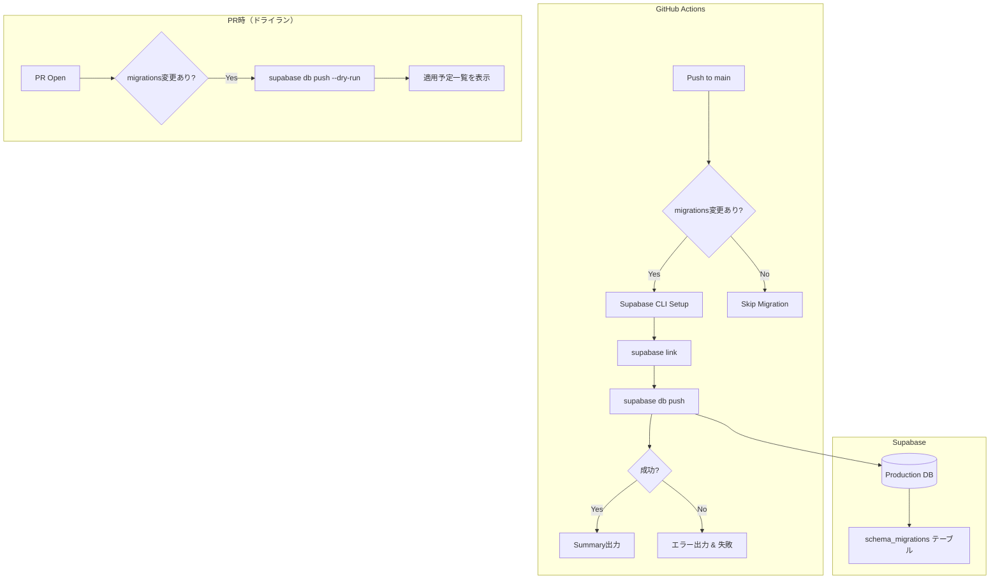

# Story 007-01: CI/CDパイプライン構築

## 概要

GitHub Actionsを使用したCI/CDパイプラインを構築し、マイグレーション自動実行やデプロイの自動化を実現する。

## ユーザーストーリー

```
AS A 開発者
I WANT mainブランチへのマージ時にDBマイグレーションが自動適用される
SO THAT 手動実行の漏れを防ぎ、本番環境との一貫性を担保できる
```

## スコープ

### 含むもの

- Supabase CLIによるマイグレーション自動実行
- PRでのマイグレーションドライラン
- GitHub Secretsによる認証情報管理

### 含まないもの

- アプリケーションデプロイ（別Subtaskで対応）
- ロールバック機能（Supabase CLI未サポート）

## Acceptance Criteria（Storyレベル）

- [ ] mainブランチへのpush時にマイグレーションが自動実行される
- [ ] PRでマイグレーションのドライラン結果が確認できる
- [ ] 認証情報がSecrets経由で安全に管理されている
- [ ] マイグレーション失敗時にCIが失敗ステータスとなる

## 関連Subtask

| ID | 名前 | 概要 | ステータス |
|---|---|---|---|
| [007-01-01](./007-01-01.md) | CIマイグレーション自動実行 | Supabase CLIでmainマージ時にDB変更を自動適用 | pending |

## 技術設計

### アーキテクチャ



### 必要なSecrets

| Secret名 | 用途 |
|---|---|
| `SUPABASE_ACCESS_TOKEN` | Supabase API認証 |
| `SUPABASE_PROJECT_REF` | プロジェクト識別子 |

## 依存関係

- `supabase/migrations/` にマイグレーションファイルが存在すること

## ステータス

- **status**: in_progress
- **開始日**: 2025-01-18
