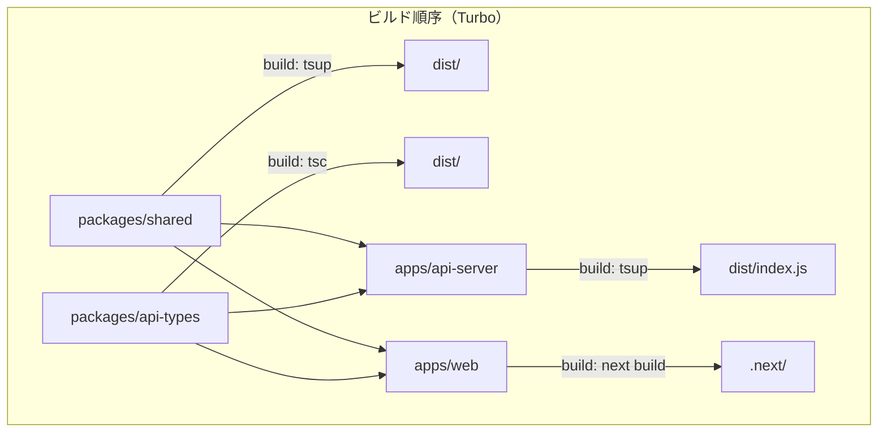

# Story 007-03: 本番ビルド検証・整備

## 概要

モノレポ内の全コンポーネント（フロントエンド・バックエンドAPI・共有パッケージ）が本番ビルド可能な状態を維持し、CIで継続的に検証する仕組みを整備する。

## ユーザーストーリー

```
AS A 開発者・運用者
I WANT 全コンポーネントの本番ビルドがCIで検証され、APIサーバーがスタンドアロンで起動可能な状態
SO THAT デプロイ時のビルド失敗を未然に防ぎ、将来のデプロイ構成変更にも柔軟に対応できる
```

## 背景・課題

現行の本番ビルドには以下の問題がある:

1. **CIでビルド未検証** — `ci.yml` は lint/format/type-check/test のみ。`pnpm build` を実行しておらず、ビルド退行が検出されない
2. **api-server の tsc ビルドが実行不可** — `tsc` の出力はESM拡張子なし・shared が `.ts` を直接export しているため、`node dist/index.js` が起動しない
3. **packages/shared にビルドステップなし** — `noEmit: true` で型チェックのみ。ソース `.ts` ファイルを直接exportしており、Node.jsランタイムから直接importできない

## スコープ

### 含むもの

- CIワークフローへの `pnpm build` ステップ追加
- api-server のバンドルビルド整備（tsup導入）
- packages/shared のビルドステップ追加（tsup導入）

### 含まないもの

- Docker化・コンテナオーケストレーション
- Vercel以外のデプロイ先設定
- packages/pipeline のビルド整備（tsx実行で十分なため）

## Acceptance Criteria（Storyレベル）

- [ ] CIで `pnpm build` が実行され、ビルド失敗時にCIが失敗する
- [ ] api-server が `node dist/index.js` でスタンドアロン起動可能
- [ ] packages/shared が `dist/` にトランスパイル済みJSを出力する
- [ ] 既存のテスト・lint・type-check が引き続きパスする

## 関連Subtask

| ID                          | 名前                         | 概要                                               | ステータス |
| --------------------------- | ---------------------------- | -------------------------------------------------- | ---------- |
| [007-03-01](./007-03-01.md) | CIビルド検証ステップ追加     | ci.yml に `pnpm build` ステップを追加              | completed  |
| [007-03-02](./007-03-02.md) | api-serverバンドルビルド整備 | tsc → tsup に移行、スタンドアロン起動可能にする    | completed  |
| [007-03-03](./007-03-03.md) | packages/sharedビルド整備    | noEmit: true → tsup でトランスパイル済みJS出力する | completed  |

## 技術設計

### ビルド依存関係



### ツール選定: tsup

- esbuildベースの高速バンドラー
- ESM/CJS 両出力対応
- `dts` オプションで型定義生成
- モノレポ内パッケージのインライン化が可能
- `external` 指定で node_modules は除外可能

## 依存関係

- EPIC 007-01, 007-02 完了済み（CI/CD基盤は構築済み）
- packages/shared, apps/api-server の既存テストがパスすること

## ステータス

- **status**: completed
- **作成日**: 2026-02-15
