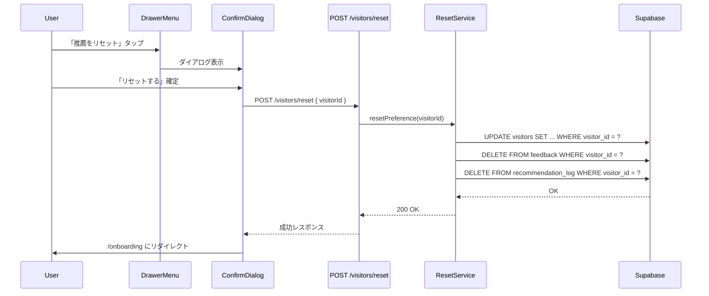

# EPIC-013: 嗜好リセット機能

## 概要

蓄積された趣味嗜好データをリセットし、オンボーディング（スターターパック選択）からやり直せる機能を実装する。

**status**: completed

## ユーザーストーリー

**ペルソナ**: SCP記事を継続的に閲覧しているリピートユーザー
**目的**: 蓄積された嗜好データをリセットし、異なるジャンルの記事に出会いたい
**価値**: 嗜好の固定化から脱却し、新たなSCP作品を発見できる
**理由**: 同傾向の記事が繰り返し推薦され、マンネリ感が生じている

## 背景

### プロダクト思想

- 既存の探索・発見重視設計の自然な延長
- 嗜好の固定化を避け、新たな発見を促す機能
- 「リセット＝失敗」ではなく「新たな旅立ち」というポジティブな位置づけ

### リセット定義（完全リセット + 安全弁）

**リセット対象:**

| テーブル/カラム                            | リセット内容 |
| ------------------------------------------ | ------------ |
| `visitors.preference_vector`               | → NULL       |
| `visitors.tag_weights`                     | → `{}`       |
| `visitors.object_class_preference`         | → `{}`       |
| `visitors.starter_pack`                    | → NULL       |
| `visitors.onboarding_completed_at`         | → NULL       |
| `feedback`（該当visitor_id全行）           | → DELETE     |
| `recommendation_log`（該当visitor_id全行） | → DELETE     |

**リセット対象外（安全弁）:**

| テーブル              | 理由                             |
| --------------------- | -------------------------------- |
| `favorites`           | お気に入りはユーザーの明示的意思 |
| `view_history`        | 閲覧履歴は参照価値がある         |
| `visitors.visitor_id` | 識別子は維持                     |

### 既存構造との整合性

- `onboarding_completed_at`がNULLになるため、`/recommend` APIは400を返し、フロントエンドがオンボーディング画面にリダイレクト
- お気に入りは`feedback`と独立テーブルのため問題なし
- `preference-vector.ts`は入力データが空なら計算スキップ（NULL維持）

## EPIC-level Acceptance Criteria

- [x] 嗜好データ（preference_vector, tag_weights, object_class_preference, starter_pack, onboarding_completed_at）がリセットされる
- [x] feedback、recommendation_logが削除される
- [x] favorites、view_historyは保持される
- [x] ドロワーメニューからリセットを実行できる
- [x] 確認ダイアログで誤操作が防止される
- [x] リセット後にオンボーディング画面にリダイレクトされる
- [x] リセット操作が冪等である

## Story一覧

| ID                                            | 名前         | 概要                                            | ステータス |
| --------------------------------------------- | ------------ | ----------------------------------------------- | ---------- |
| [013-01](./013-01-preference-reset/013-01.md) | 嗜好リセット | API・共通インターフェース・フロントエンドUI実装 | completed  |

## 技術設計

### データフロー

### 実装スコープ

| レイヤー   | 実装内容                                              |
| ---------- | ----------------------------------------------------- |
| shared     | `PreferenceStorage` に `resetPreference` メソッド追加 |
| api-server | `POST /visitors/reset` エンドポイント新設             |
| web        | ドロワーメニュー + 確認ダイアログ + リダイレクト      |

### 既存資産の活用

| 既存メソッド                                         | 用途                   |
| ---------------------------------------------------- | ---------------------- |
| `SupabasePreferenceStorage.clearFeedback()`          | feedback全件削除       |
| `SupabasePreferenceStorage.clearRecommendationLog()` | 推薦ログ全件削除       |
| `SupabasePreferenceStorage.saveProfile()`            | プロファイル初期化保存 |

## 依存関係

- EPIC-004（推薦ロジック実装）: PreferenceStorage インターフェース
- EPIC-005（バックエンドAPI）: visitors ドメイン、Hono RPC パターン
- EPIC-006（フロントエンドUI）: DrawerMenu コンポーネント、オンボーディングフロー
