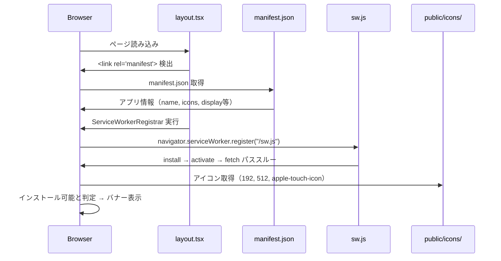

# Story 015-01: PWA基盤実装

## 概要

SCPicksをPWAとしてインストール可能にするための基盤を実装する。Web App Manifest、最小Service Worker、メタデータ設定、アプリアイコン配置を行う。

**status**: pending

## ユーザーストーリー

**As a** SCPicksの利用者
**I want** アプリをホーム画面に追加してネイティブアプリのように使いたい
**So that** ブラウザを開かずにワンタップでSCP推薦にアクセスできる

## Story-level Acceptance Criteria

- [ ] ブラウザがアプリをインストール可能と判定する（Lighthouse PWA Installable）
- [ ] ホーム画面から起動時にスタンドアロンモードで表示される
- [ ] Android / iOS の両方でホーム画面追加が動作する
- [ ] 既存機能に影響がない

## Subtask一覧

| ID                          | 名前                                | 概要                                            | ステータス | 依存      |
| --------------------------- | ----------------------------------- | ----------------------------------------------- | ---------- | --------- |
| [015-01-01](./015-01-01.md) | Web App Manifest + メタデータ設定   | manifest.json作成、layout.tsxメタデータ追加     | pending    | -         |
| [015-01-02](./015-01-02.md) | Service Worker + 登録コンポーネント | sw.js最小構成、ServiceWorkerRegistrar作成・配置 | pending    | 015-01-01 |
| [015-01-03](./015-01-03.md) | アプリアイコン配置                  | 生成済みアイコンをpublic/に配置、favicon設定    | pending    | 015-01-01 |

## 技術設計

### データフロー

### 変更対象

| レイヤー     | ファイル                                       | 変更内容                            |
| ------------ | ---------------------------------------------- | ----------------------------------- |
| web (public) | `manifest.json`                                | 新規作成                            |
| web (public) | `sw.js`                                        | 新規作成                            |
| web (public) | `icons/*`, `favicon.ico`                       | 新規配置                            |
| web (src)    | `shared/components/ServiceWorkerRegistrar.tsx` | 新規作成                            |
| web (src)    | `app/layout.tsx`                               | メタデータ追加 + コンポーネント配置 |
